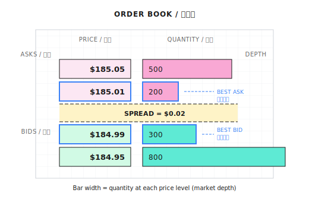
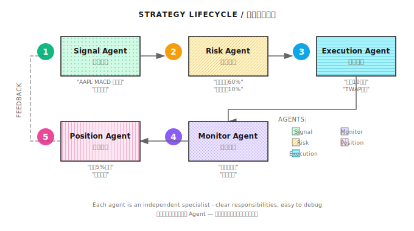

# 第02课：金融市场与交易基础

## 一个昂贵的教训

一位量化新手开发了回测年化收益 80%、夏普比率 2.0 的策略，实盘第一周买入 10,000 股中小市值股票，预期成本 $250,000，实际成交 $253,500。

**三大原因：**
- 滑点：市价单吃掉多档报价，均价偏高 $0.30/股
- 手续费：佣金 + SEC 费用 ≈ $50
- 市场冲击：大单占日均成交量 2%，引起其他交易者注意

三个月后，实盘收益比回测低 40%。

---

## 2.1 市场类型

### 不同市场特点

| 市场 | 交易时间 | 杠杆 | 做空 | 适合策略 |
|------|----------|------|------|----------|
| 股票 | A股 9:30-15:00；美股 9:30-16:00 ET | 融资融券有限 | 受限 | 多因子、事件驱动 |
| 期货 | 接近 24 小时 | 高（5-20倍） | 天然支持 | CTA、套利 |
| 外汇 | 24 小时（周末除外） | 美国≤50:1，欧盟≤30:1 | 天然支持 | 趋势跟随、套息 |
| 加密货币 | 7×24 小时 | 1-100倍 | 天然支持 | 高频、跨所套利 |

**对 Agent 的影响：**
- 加密货币 7×24 → Agent 必须全天候运行
- 期货高杠杆 → Risk Agent 止损逻辑必须更严格
- A股 T+1 → Execution Agent 需考虑隔夜风险

### 交易所与撮合机制

撮合规则：
1. 价格优先：出价高的买单优先成交
2. 时间优先：同价格下，先到的订单优先成交

---

## 2.2 交易的基本单位

### 标的 (Asset)

| 市场 | 标的示例 | 代码格式 |
|------|----------|----------|
| A股 | 贵州茅台 | 600519.SH |
| 美股 | Apple | AAPL |
| 加密货币 | 比特币 | BTC/USDT |
| 期货 | 沪深300股指期货 | IF2401 |

### 时间尺度

```
Tick 数据（最细）
    ↓ 聚合
分钟 K 线（1min, 5min, 15min）
    ↓ 聚合
日线 / 周线 / 月线（最粗）
```

**OHLCV (K线)**：Open / High / Low / Close / Volume

### 订单簿 (Order Book)



**Spread** = Best Ask - Best Bid
- 价差越小 → 流动性越好 → 交易成本越低
- 价差越大 → 流动性越差 → 滑点风险越高

---

## 2.3 交易成本的真实影响

### 滑点 (Slippage)

```
你要买 1000 股 AAPL，订单簿如下：
  $185.01 - 200 股
  $185.05 - 500 股
  $185.10 - 300 股

实际均价 = (185.01×200 + 185.05×500 + 185.10×300) / 1000 = $185.057
滑点 = $0.047 / 股 = 总计 $47
```

### 手续费累积效应

```python
fee_rate = 0.001
principal = 100_000
trade_size = 10_000
trades_per_day = 50
trading_days = 250

daily_fee = fee_rate * trade_size * trades_per_day
annual_fee = daily_fee * trading_days
annual_fee_rate = annual_fee / principal
print(f"年化手续费成本: {annual_fee_rate:.1%}")  # 输出: 125.0%
```

50笔/天 × 250天 = 12,500笔，累积效应惊人。

### 市场冲击 (Market Impact)

**平方根定律**：

```
市场冲击 ≈ Y × σ × √(Q/V)

Y = 常数（通常 0.5-1.0）
σ = 日波动率
Q = 你的下单量
V = 日均成交量
```

```python
def estimate_market_impact(order_size, daily_volume, daily_volatility, Y=0.5):
    participation = order_size / daily_volume
    impact = Y * daily_volatility * (participation ** 0.5)
    return impact

impact = estimate_market_impact(
    order_size=1_000_000,
    daily_volume=100_000_000,
    daily_volatility=0.02
)
print(f"预估市场冲击: {impact:.2%}")  # 输出: 0.10%
```

### 成本汇总

| 成本类型 | 典型范围 | 谁最受影响 |
|----------|----------|------------|
| 滑点 | 0.01% - 0.5% | 大单、低流动性标的 |
| 手续费 | 0.01% - 0.1% / 笔 | 高频策略 |
| 市场冲击 | 0.05% - 1%+ | 大资金、小市值标的 |

### 纸上练习：你的策略真的赚钱吗？

**场景参数：**

| 参数 | 数值 |
|------|------|
| 策略本金 | $100,000 |
| 回测年化收益 | 35% |
| 平均每日交易次数 | 20 次 |
| 平均每笔交易金额 | $50,000 |
| 券商佣金 | $0 |
| SEC 费用 | 0.00278%（卖出时） |
| 平均滑点 | 0.03% |
| 交易天数 | 252 天/年 |

**答案：**

- 单笔滑点 = $50,000 × 0.03% = **$15**
- 单笔 SEC = $50,000 × 0.00278% = **$1.39**
- 日均滑点 = $15 × 20 = **$300**
- 日均 SEC = $1.39 × 10 = **$13.9**
- 日均总成本 = **$313.9**
- 年化总成本 = $313.9 × 252 = **$79,103**

| 计算方式 | 公式 | 结果 | 含义 |
|----------|------|------|------|
| 相对总交易额 | $79,103 ÷ $252,000,000 | 0.031% | 每笔交易的成本占比 |
| 相对本金 | $79,103 ÷ $100,000 | **79.1%** | 成本侵蚀了多少本金 |

年化总交易额 = $50,000 × 20次 × 252天 = $252,000,000（换手率 = 2520倍）

**实盘年化收益 = 35% - 79.1% = -44.1%**（大亏！）

---

## 2.4 策略生命周期



完整流程：

1. **信号生成 (Signal Agent)**：识别交易机会，如"MACD 底背离，建议做多"
2. **风控审核 (Risk Agent)**：检查仓位限制，可能拒绝、缩小或通过
3. **下单执行 (Execution Agent)**：拆单执行，如"拆成 10 个小单，每 30 秒发一个，用 TWAP 算法"
4. **成交监控 (Monitor Agent)**：实时反馈执行质量，滑点超阈值则暂停
5. **持仓管理与平仓 (Position Agent)**：触发移动止盈或止损平仓，闭环完成

---

## 本课要点回顾

- 理解不同市场（股票/期货/外汇/加密）的特点和对策略的影响
- 掌握 OHLCV 和订单簿的基础结构
- 认识交易成本三大杀手：滑点、手续费、市场冲击
- 理解策略生命周期的完整闭环：信号 → 风控 → 执行 → 监控 → 平仓

---

## 验收标准

| 检查项 | 验收标准 |
|--------|----------|
| 成本计算 | 能独立完成纸上练习，误差 < 10% |
| 订单簿理解 | 能解释为什么大单会产生滑点 |
| 市场差异 | 能说出 A股 vs 美股 vs 加密 的 3 个关键差异 |
| 生命周期 | 能画出策略从信号到平仓的流程图 |

---

**下一课**：第 03 课——数学与统计基础，讲解为何用收益率而非价格，以及厚尾分布与正态分布假设的危险。
