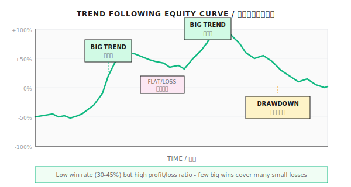
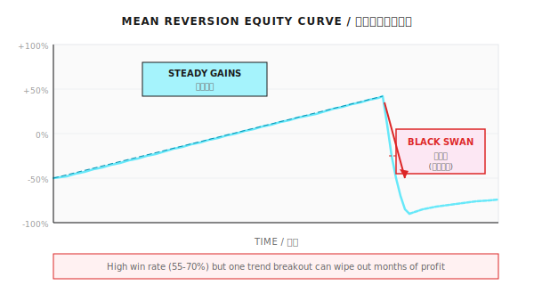
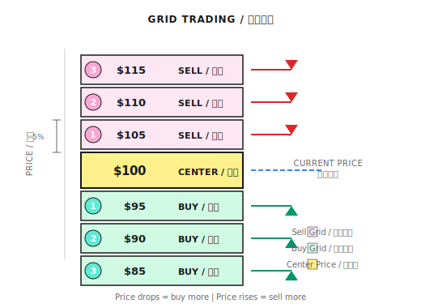

# 第05课：经典策略范式

## 两种交易者的命运

2020年3月疫情暴跌中，趋势跟随者做空盈利40%，年底翻三倍；均值回归者抄底爆仓。2021年震荡期，结果反转。

**核心教训：**
1. 没有策略能适应所有市场
2. 识别市场状态比选择策略更重要

---

## 5.1 趋势跟随

### 核心思想
"趋势是你的朋友，直到它不再是。"

| 特点 | 描述 |
|------|------|
| 胜率 | 30-45% |
| 盈亏比 | 高，3-10倍 |
| 适用市场 | 趋势明显（牛/熊市） |
| 致命场景 | 震荡市反复被打脸 |

### 双均线策略

```
规则：
- 金叉买入：短期均线上穿长期均线（MA5 > MA20）
- 死叉卖出：短期均线下穿长期均线（MA5 < MA20）
```

| 参数组合 | 适用场景 | 特点 |
|----------|----------|------|
| MA5/MA20 | 短线交易 | 灵敏，假信号多 |
| MA10/MA60 | 中线交易 | 平衡 |
| MA20/MA120 | 长线投资 | 稳定，滞后严重 |

**优化方向：**
- 加入趋势过滤器（ADX > 25才开仓）
- 加入成交量确认
- 多周期验证

### 日内趋势交易

```
规则：
1. 开盘后30分钟，观察价格方向
2. 突破开盘价0.5%，顺势开仓
3. 止损设在开盘价另一侧0.5%
4. 收盘前平仓，不留隔夜风险
```

### 趋势跟随的风险特征



- 震荡期会连续小亏
- 需承受10-20次连续止损
- 靠少数几次大趋势赚回亏损

---

## 5.2 均值回归

### 核心思想
"涨多了会跌，跌多了会涨。"

| 特点 | 描述 |
|------|------|
| 胜率 | 55-70% |
| 盈亏比 | 低，单笔盈利通常小于亏损 |
| 适用市场 | 震荡市、有界区间 |
| 致命场景 | 趋势突破，越抄越跌 |



### 网格交易策略



**规则示例：**
- 价格下跌到95 → 买入1份
- 价格下跌到90 → 再买1份
- 价格上涨到105 → 卖出1份
- 价格上涨到110 → 再卖1份

| 参数 | 建议值 | 说明 |
|------|--------|------|
| 网格间距 | 3-5% | 太小手续费吃利润 |
| 总网格数 | 5-10格 | 太多资金分散 |
| 单格仓位 | 总资金/网格数 | 确保最坏情况不爆仓 |

**重要警告：** 网格交易最怕单边下跌，务必设置整体止损。

### 配对交易 (Pairs Trading)

```
示例：SPY vs IVV（两只追踪S&P 500的ETF）

计算标准化价差：
  标准化价差 = (SPY收益率 - IVV收益率) 的Z-score

当Z-score > 2：SPY相对高估
当Z-score < -2：SPY相对低估

操作（Z-score = 2.5）：
- 做空$10,000 SPY
- 做多$10,000 IVV（等金额对冲）
- 等待Z-score回归到0附近平仓
```

| 概念 | 定义 | 举例 |
|------|------|------|
| 相关性 | 两个序列同涨同跌 | 黄金和黄金ETF |
| 协整性 | 两个序列的差值是稳定的 | SPY和IVV |

---

## 5.3 多策略组合

### 策略相关性

| 策略A | 策略B | 相关性 | 组合效果 |
|-------|-------|--------|----------|
| 趋势跟随 | 趋势跟随 | 高 | 无分散效果 |
| 趋势跟随 | 均值回归 | 低/负 | 良好分散 |
| 股票多头 | 债券 | 负 | 优秀分散 |

### 资本分配方法

**方法1：等权分配**
```
策略A: 33%
策略B: 33%
策略C: 34%
```

**方法2：风险平价 (Risk Parity)**
```
按波动率的倒数分配：
策略A波动率20% → 权重 ∝ 1/0.20 = 5
策略B波动率10% → 权重 ∝ 1/0.10 = 10
策略C波动率40% → 权重 ∝ 1/0.40 = 2.5

标准化后：
策略A: 5/17.5 ≈ 29%
策略B: 10/17.5 ≈ 57%
策略C: 2.5/17.5 ≈ 14%
```

**方法3：动态调整**
- 趋势市场 → 增加趋势策略权重
- 震荡市场 → 增加均值回归策略权重

---

## 5.4 高风险策略警示

### 马丁格尔策略（慎用）

```
逻辑：
第1次下注$100，输
第2次下注$200，输
第3次下注$400，输
第4次下注$800，赢！

赢了$800，之前亏了$700，净赚$100
```

| 连亏次数 | 累计投入 | 单次下注 |
|----------|----------|----------|
| 1 | $100 | $100 |
| 5 | $3,100 | $1,600 |
| 10 | $102,300 | $51,200 |

**10次连亏需要10万美金，收益只有$100。**

50%胜率下，连亏10次概率约0.1%，但交易1000次就会遇到一次。

---

## 5.5 期权策略简介（进阶）

### 期权基础概念

| 术语 | 含义 |
|------|------|
| 认购期权(Call) | 有权以约定价格买入 |
| 认沽期权(Put) | 有权以约定价格卖出 |
| 行权价(Strike) | 约定的买卖价格 |
| 权利金 | 购买期权的价格 |

### 牛市价差策略 (Bull Call Spread)

**操作：**
1. 买入低行权价认购期权（如100元Call）
2. 卖出高行权价认购期权（如110元Call）

| 特点 | 描述 |
|------|------|
| 成本 | 低于直接买Call |
| 最大亏损 | 权利金净支出 |
| 最大盈利 | 行权价差 - 净权利金 |
| 适用场景 | 预期温和上涨 |

### 末日期权策略（高风险）

| 特点 | 描述 |
|------|------|
| 潜在收益 | 可能10倍以上 |
| 潜在亏损 | 权利金归零（100%损失） |
| 胜率 | 通常低于20% |
| 仓位建议 | 不超过总资金的5% |

### Gamma Scalping（专业）

```
简化示意：
1. 持有Call期权（做多Gamma）
2. 价格上涨 → Delta变大 → 卖出股票对冲
3. 价格下跌 → Delta变小 → 买入股票对冲
4. 反复操作，赚取波动差价
```

**盈利条件：** 实际波动率 > 隐含波动率

---

## 5.6 策略选择框架

### 可证伪的策略选择规则

| 指标条件 | 判定结果 | 推荐策略 | 失效信号 |
|----------|----------|----------|----------|
| ADX > 25且持续5日以上 | 趋势确认 | 趋势跟随 | ADX < 20连续3日 |
| ADX < 20且价格在布林带内震荡 | 震荡确认 | 均值回归 | 价格突破布林带2σ |
| 波动率 > 历史90分位 | 危机模式 | 减仓/对冲 | 波动率回落到50分位 |
| 以上均不满足 | 不确定 | 降低仓位50% | 任一条件满足 |

```
如果以下条件满足 → 使用趋势跟随：
  1. ADX(14) > 25 连续5天
  2. 价格在20日均线同侧连续10天
  3. 近20日收益率显著不为0（t检验p < 0.05）

如果以下条件满足 → 使用均值回归：
  1. ADX(14) < 20 连续5天
  2. 价格在布林带（20日，2σ）内震荡
  3. 近20日收益率接近0（t检验p > 0.2）

如果以上条件均不满足 → 降低仓位至50%，等待信号明确
```

### Regime切换的过渡期处理

| 切换场景 | 风险 | 应对策略 |
|----------|------|----------|
| 震荡→趋势 | 均值回归策略被套 | 突破信号出现后立即减仓 |
| 趋势→震荡 | 趋势策略连续假突破 | ADX下降时逐步减仓 |
| 正常→危机 | 所有策略同时亏损 | 波动率飙升时优先减仓 |

**切换期保守规则：**
1. 确认滞后：Regime变化确认需要3-5天
2. 减仓优先：先减仓再换策略
3. 亏损容忍：预留5-10%的"切换成本"

### 策略对比总结

| 维度 | 趋势跟随 | 均值回归 | 网格交易 |
|------|----------|----------|----------|
| 胜率 | 30-45% | 55-70% | 60-75% |
| 盈亏比 | 3:1以上 | 1:2左右 | 1:3左右 |
| 最大回撤 | 20-40% | 15-30% | 可能爆仓 |
| 适用市场 | 趋势市 | 震荡市 | 震荡市 |

### 常见误区

**误区一：高胜率策略更好**
期望收益 = 胜率 × 盈利 - 败率 × 亏损。胜率40%但盈亏比3:1优于胜率70%盈亏比0.5:1。

**误区二：回测最优参数就是最优参数**
参数±20%变化后收益剧变，说明过拟合。

**误区三：趋势策略在震荡市调参就能盈利**
震荡市无趋势，再怎么调参也无法盈利，应切换策略。

**误区四：网格交易是"稳赚"策略**
单边下跌会越跌越买，资金被套死，必须设整体止损。

**误区五：经典策略永远有效**
策略同质化（Strategy Crowding）风险真实存在。2024年初，中国头部量化基金因小盘股因子拥挤集体亏损8-13%。

### 多智能体视角

| Agent | 主要策略 | 激活条件 |
|-------|----------|----------|
| Trend Agent | 趋势跟随 | Regime Agent判定为趋势市 |
| Mean Reversion Agent | 均值回归 | Regime Agent判定为震荡市 |
| Crisis Agent | 防御策略 | 波动率飙升或出现异常 |
| Portfolio Agent | 多策略组合 | 动态调整各策略权重 |
| Risk Agent | 风控 | 永远在线，一票否决 |

---

## 代码实现（可选）

### 双均线策略回测框架

```python
import pandas as pd
import numpy as np

def dual_ma_strategy(df, short_window=5, long_window=20):
    """
    双均线策略
    返回持仓信号：1=多头，-1=空头，0=空仓
    """
    df = df.copy()
    df['MA_Short'] = df['close'].rolling(short_window).mean()
    df['MA_Long'] = df['close'].rolling(long_window).mean()

    # 生成信号
    df['signal'] = 0
    df.loc[df['MA_Short'] > df['MA_Long'], 'signal'] = 1   # 金叉做多
    df.loc[df['MA_Short'] < df['MA_Long'], 'signal'] = -1  # 死叉做空

    return df['signal']


def grid_trading_signal(price, grid_center, grid_step, num_grids):
    """
    网格交易信号
    返回建议仓位变化
    """
    position_change = 0
    for i in range(1, num_grids + 1):
        buy_level = grid_center * (1 - grid_step * i)
        sell_level = grid_center * (1 + grid_step * i)

        if price <= buy_level:
            position_change = i  # 越跌买越多
        elif price >= sell_level:
            position_change = -i  # 越涨卖越多

    return position_change


def calculate_strategy_metrics(returns):
    """计算策略评价指标"""
    total_return = (1 + returns).prod() - 1
    annual_return = (1 + total_return) ** (252 / len(returns)) - 1
    volatility = returns.std() * np.sqrt(252)
    sharpe = annual_return / volatility if volatility > 0 else 0

    # 正确的最大回撤计算（基于权益曲线，非收益累加）
    equity = (1 + returns).cumprod()
    running_max = equity.cummax()
    drawdown = (equity - running_max) / running_max
    max_drawdown = drawdown.min()

    return {
        'total_return': f'{total_return:.2%}',
        'annual_return': f'{annual_return:.2%}',
        'volatility': f'{volatility:.2%}',
        'sharpe_ratio': f'{sharpe:.2f}',
        'max_drawdown': f'{max_drawdown:.2%}'
    }
```

---

## 本课要点回顾

- 趋势跟随：低胜率、高盈亏比、怕震荡
- 均值回归：高胜率、低盈亏比、怕趋势突破
- 网格交易和配对交易的基本原理
- 马丁格尔策略的致命风险
- 多策略组合的价值和方法
