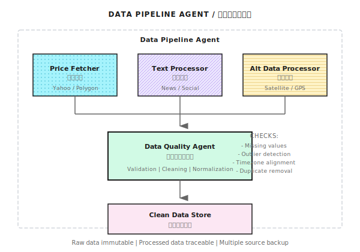

# 第06课：数据工程的残酷现实

## 核心观点
> "数据问题杀死的策略比模型问题多得多。"

---

## 一、引言故事

一位开发者部署了回测年化80%、夏普2.5的策略，上线后连续遭遇：
- API限流（429错误）
- NaN数据触发错误信号清仓
- 时区不统一、字段名不一致

结果整整一周没写策略代码，全在处理数据问题。

---

## 6.1 数据源选择

### 免费数据源

| 数据源 | 覆盖市场 | 优点 | 缺点 |
|--------|----------|------|------|
| Yahoo Finance (yfinance) | 美股、ETF | 免费、历史长 | 近年有不稳定反馈 |
| Alpaca Markets | 美股 | IEX数据免费 | 免费版覆盖有限 |
| Binance API | 加密货币 | 实时、免费 | 只有Binance数据 |
| Alpha Vantage | 股票、外汇、加密 | 免费层可用 | 请求配额低 |
| CCXT | 加密货币 | 统一接口 | 依赖各交易所API |

### 付费数据源（参考价格）

| 数据源 | 月费 | 特点 |
|--------|------|------|
| Bloomberg | $2,500+ | 机构标配，质量最高 |
| LSEG Workspace | 按需报价 | 原Reuters数据 |
| Polygon.io（现Massive） | $99+ | 开发者友好 |
| Nasdaq Data Link | 按数据集定价 | 另类数据 |

### 选择路径

```
个人学习/研究 → 免费数据源 + 容忍数据问题
小型基金(<$1M) → 付费基础套餐 + 自建数据校验
机构级(>$10M)  → Bloomberg/Refinitiv + 多源交叉验证
```

**核心原则**：数据质量决定策略上限。垃圾进，垃圾出。

### 数据源演进路径

| 阶段 | 推荐数据源 | 说明 |
|------|-----------|------|
| 学习/原型 | Yahoo Finance | 免费日线，够用 |
| 小规模实盘 | Polygon.io / Alpaca | 实时行情，API友好 |
| 机构级生产 | Databento / 交易所直连 | L1/L2实时数据，低延迟 |

---

## 6.2 API的痛苦现实

### 健壮数据获取（伪代码框架）

```python
# 注意：以下为伪代码，展示健壮数据获取的设计模式
# api, log, EmptyDataError, RateLimitError 需替换为你使用的具体库

import time
from typing import Optional
import pandas as pd

def get_history_robust(
    symbol: str,
    days: int,
    max_retries: int = 5,
    backoff_base: float = 2.0
) -> Optional[pd.DataFrame]:
    for attempt in range(max_retries):
        try:
            data = api.get_history(symbol, days=days, timeout=30)

            if data is None:
                raise EmptyDataError(f"No data for {symbol}")
            if len(data) == 0:
                raise EmptyDataError(f"Empty data for {symbol}")
            if len(data) < days * 0.9:
                log.warning(f"Data incomplete: got {len(data)}, expected ~{days}")
            if data['close'].isnull().any():
                log.warning("NaN values detected, filling...")
                data['close'] = data['close'].ffill()

            return data

        except RateLimitError:
            wait_time = backoff_base ** attempt
            log.info(f"Rate limited, waiting {wait_time}s...")
            time.sleep(wait_time)
        except ConnectionError:
            log.warning("Connection lost, reconnecting...")
            api.reconnect()
            time.sleep(1)
        except TimeoutError:
            log.warning("Request timeout, retrying...")
        except Exception as e:
            log.error(f"Unexpected error: {e}")
            if attempt == max_retries - 1:
                raise

    return None
```

### 常见API问题

| 问题 | 表现 | 解决方案 |
|------|------|----------|
| Rate Limiting | 429错误 | 指数退避重试+请求队列 |
| 数据缺失 | 空响应或部分数据 | 多数据源备份+缺失检测 |
| 数据延迟 | 时间戳落后 | 记录延迟+调整策略 |
| 格式不一致 | 字段名变化 | 统一数据适配层 |
| 连接不稳定 | 断连、超时 | 心跳检测+自动重连 |

### Rate Limiting的真实成本

| API限制 | 完成100标的时间 |
|---------|--------------|
| 1请求/秒 | 100秒 |
| 10请求/秒 | 10秒 |
| 无限制 | <1秒 |

---

## 6.3 时间对齐问题

### 时区混乱

| 数据源 | 默认时区 |
|--------|---------|
| Binance | UTC |
| Yahoo Finance | 交易所当地时间 |
| A股数据 | UTC+8 |
| 美股数据 | ET (Eastern Time) |

**解决方案**：全部转换为UTC。

```python
import pandas as pd

def normalize_timezone(df, source_tz='UTC'):
    """统一转换为 UTC"""
    if df.index.tz is None:
        df.index = df.index.tz_localize(source_tz)
    df.index = df.index.tz_convert('UTC')
    return df
```

### Tick到K线聚合

| 字段 | 说明 |
|------|------|
| 开盘价 | 该时间段第一笔成交价 |
| 收盘价 | 该时间段最后一笔成交价 |
| 最高/最低价 | 时间段极值 |
| 成交量 | 所有成交量之和 |

无成交分钟的处理方案（三选一）：
1. 用前一分钟收盘价填充OHLC
2. 标记为缺失，后续处理
3. 从聚合中排除该时间点

### 跨资产交易时间差异

| 资产 | 交易时间 |
|------|---------|
| A股 | 9:30-11:30, 13:00-15:00 |
| 美股 | 9:30-16:00 ET |
| 外汇 | 7×24（接近） |
| 加密货币 | 7×24 |

---

## 6.4 数据质量问题

### 异常值检测与处理

| 异常类型 | 识别方法 | 处理方法 |
|----------|---------|---------|
| 价格跳变 | 涨跌幅>20% | 检查是否真实（拆股？） |
| 成交量异常 | 0或极大值 | 检查交易所状态 |
| 缺失值 | NaN | 前值填充或删除 |
| 重复数据 | 时间戳重复 | 保留第一条或最后一条 |

```python
def detect_anomalies(df, price_col='close', volume_col='volume'):
    """检测数据异常"""
    issues = []

    returns = df[price_col].pct_change()
    jumps = returns.abs() > 0.20
    if jumps.any():
        issues.append(f"Price jumps detected: {jumps.sum()} times")

    zero_volume = df[volume_col] == 0
    if zero_volume.any():
        issues.append(f"Zero volume: {zero_volume.sum()} bars")

    nulls = df.isnull().sum()
    if nulls.any():
        issues.append(f"Null values: {nulls.to_dict()}")

    duplicates = df.index.duplicated()
    if duplicates.any():
        issues.append(f"Duplicate timestamps: {duplicates.sum()}")

    return issues
```

### 股票分红拆股调整

**不复权的后果**：除权日产生虚假信号，收益率出现极端值。

| 事件 | 未复权数据 | 复权后数据 |
|------|----------|----------|
| 10送10 | 前后价格断崖 | 平滑连续 |
| 分红 | 除息日跳空 | 调整历史价格 |

### 期货换月

两个合约价格差（如4000→4050）不是真实涨跌，需计算价差并调整历史价格，或使用已处理的"主力合约连续"数据。

---

## 6.5 幸存者偏差 (Survivorship Bias)

### 定义与影响

只用"现在还存在的股票"回测，忽略退市/破产公司，导致收益被高估。

| 研究 | 结论 |
|------|------|
| 学术研究 | 年化收益高估1-3% |
| 价值投资策略 | 高估更严重 |
| 小盘股策略 | 偏差最大 |

### 避免方法

| 方法 | 实现难度 | 效果 |
|------|---------|------|
| 使用含退市股票的数据库 | 高 | 最准确 |
| 使用历史指数成分股 | 中 | 较准确 |
| 在结论中说明偏差 | 低 | 至少诚实 |

付费数据源通常提供"无幸存者偏差"数据集。

---

## 6.6 另类数据简介

### 类型概览

| 类型 | 数据源 | 应用场景 |
|------|--------|---------|
| 卫星数据 | 停车场车辆数、油罐储量 | 预测零售业绩、原油库存 |
| 文本数据 | 新闻、社交媒体、财报 | 情感分析、事件驱动 |
| 信用卡数据 | 消费支出统计 | 预测公司营收 |
| 网络流量 | 网站访问量 | 预测电商业绩 |
| GPS数据 | 手机位置 | 人流分析 |

### 挑战

| 挑战 | 说明 |
|------|------|
| 噪声大 | 信号/噪声比远低于价格数据 |
| 合规风险 | 隐私问题、数据来源合法性 |
| Alpha衰减快 | 广泛使用后优势消失 |
| 成本高 | 数据本身贵+处理成本高 |

---

## 6.7 数据管道设计原则

### 三大原则

| 原则 | 说明 |
|------|------|
| 不可变性 | 原始数据永不修改，处理后生成新文件 |
| 可追溯性 | 每条数据记录来源、处理时间、处理版本 |
| 冗余备份 | 至少两个数据源交叉验证 |

### 数据管道架构



```
数据采集层
    │
    ├─→ 原始数据存储（不可变）
    │         │
    │         ▼
    ├─→ 数据清洗层
    │     - 异常值处理
    │     - 缺失值填充
    │     - 时区标准化
    │         │
    │         ▼
    ├─→ 特征工程层
    │     - 技术指标计算
    │     - 标签生成
    │         │
    │         ▼
    └─→ 就绪数据存储 → 策略使用
```

### 监控与告警

| 监控项 | 阈值建议 | 告警动作 |
|--------|---------|---------|
| 数据延迟 | >1分钟 | 警告 |
| 数据缺失率 | >1% | 警告 |
| 异常值比例 | >0.1% | 检查 |
| API错误率 | >5% | 暂停策略 |

---

## 数据质量检查框架（完整代码）

```python
import pandas as pd
from dataclasses import dataclass
from typing import List

@dataclass
class DataQualityReport:
    symbol: str
    start_date: str
    end_date: str
    total_rows: int
    missing_rows: int
    null_values: dict
    anomalies: List[str]
    is_valid: bool

def check_data_quality(df: pd.DataFrame, symbol: str) -> DataQualityReport:
    """全面的数据质量检查"""
    anomalies = []

    # 检查时间连续性（以日频数据为例）
    idx = pd.DatetimeIndex(df.index)
    expected_index = pd.bdate_range(
        start=idx.min().normalize(),
        end=idx.max().normalize()
    )
    expected_rows = len(expected_index)
    actual_rows = len(df)
    missing_rows = expected_rows - actual_rows

    if missing_rows > expected_rows * 0.05:
        anomalies.append(f"High missing rate: {missing_rows/expected_rows:.1%}")

    null_counts = df.isnull().sum().to_dict()

    if 'close' in df.columns:
        returns = df['close'].pct_change()
        extreme_moves = (returns.abs() > 0.2).sum()
        if extreme_moves > 0:
            anomalies.append(f"Extreme price moves: {extreme_moves}")

    if 'volume' in df.columns:
        zero_volume = (df['volume'] == 0).sum()
        if zero_volume > 0:
            anomalies.append(f"Zero volume periods: {zero_volume}")

    duplicates = df.index.duplicated().sum()
    if duplicates > 0:
        anomalies.append(f"Duplicate timestamps: {duplicates}")

    return DataQualityReport(
        symbol=symbol,
        start_date=str(df.index[0]),
        end_date=str(df.index[-1]),
        total_rows=actual_rows,
        missing_rows=missing_rows,
        null_values=null_counts,
        anomalies=anomalies,
        is_valid=len(anomalies) == 0
    )
```

---

## 本课要点回顾

- 理解免费数据源和付费数据源的权衡
- 掌握处理API限流、数据缺失等问题的方法
- 认识时区混乱、幸存者偏差等隐蔽问题
- 了解另类数据的价值和挑战
- 理解数据管道的设计原则
