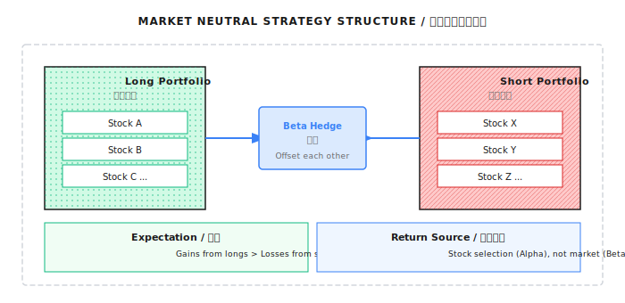
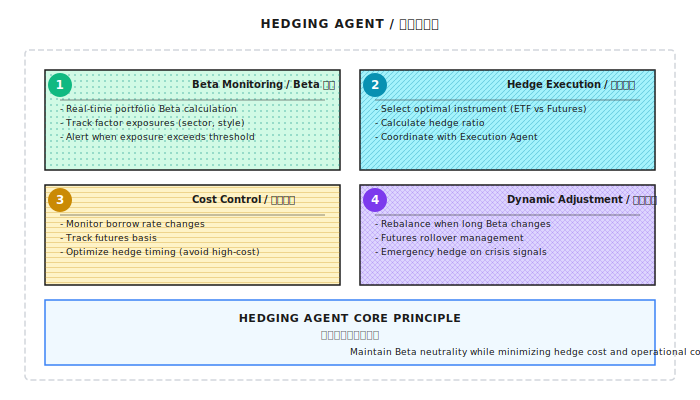
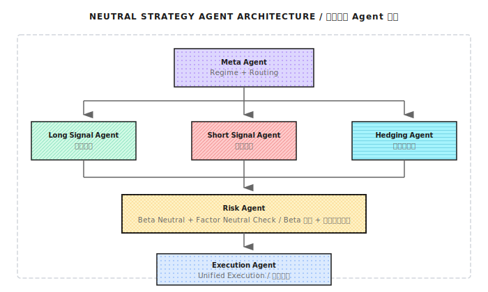

# 第08课：Beta、对冲与市场中性

## 核心概念

**Beta (β)** 衡量投资组合相对市场基准的敏感度：
- β=1.0：随市场同步涨跌
- β=0：收益与市场无关（市场中性）
- β<0：与市场反向

## 收益分解公式

```
Alpha = 策略收益 - Beta × 基准收益
```

示例：策略+25%，基准+18%，Beta=1.2
→ Alpha = 25% - 21.6% = **仅3.4%是真正技能**

## Beta对冲计算

**名义对冲≠Beta对冲**，正确公式：

```
需做空金额 = 多头金额 × (多头Beta / 空头工具Beta)
```

| 场景 | 多头 | Beta | 需做空 |
|------|------|------|--------|
| A | $500K | 1.3 | $650K |
| B | $1M | 0.6 | $600K |
| C | $800K, QQQ对冲(1.2) | 1.8 | $1.2M |

## 市场中性三层次



1. **Dollar Neutral**：等金额，无法真正消除Beta
2. **Beta Neutral**：等Beta敞口，消除市场风险
3. **Factor Neutral**：消除多种系统性风险

## 对冲成本清单

| 成本类型 | 年化估算 |
|----------|----------|
| 融券利息 | 1-10% |
| 期货基差 | 0.5-2% |
| 交易成本 | 0.1-0.3%/次 |
| 机会成本 | 2-5% |

散户实例：毛Alpha 8% - 融券5% - 交易2% = **净收益仅1%**

## 常见误区

- "等额对冲=市场中性"：忽略各资产Beta差异
- 低波动≠低风险（LTCM案例：25倍杠杆）
- 回测忽略融券可得性、召回风险、滑点

## Python收益分解代码

```python
def decompose_returns(strategy_returns, benchmark_returns, rf_rate=0.02):
    rf_daily = rf_rate / 252
    excess_strategy = strategy_returns - rf_daily
    excess_benchmark = benchmark_returns - rf_daily
    slope, intercept, r_value, _, _ = stats.linregress(
        excess_benchmark, excess_strategy
    )
    beta = slope
    alpha_annual = intercept * 252
    return {'beta': beta, 'alpha_annual': alpha_annual, 'r_squared': r_value**2}
```





## 核心结论

> 不理解Beta就不知道收益从哪来；不理解对冲就不知道风险在哪里。

市场中性策略对散户几乎不可行，机构优势体现在融券费率、Prime Broker关系、杠杆和实时风控基础设施。