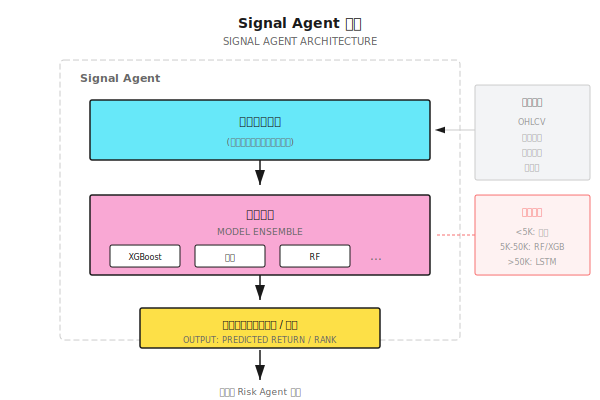

# 第09课：监督学习在量化中的应用

## 从"圣杯"到"工具"

某对冲基金用10层LSTM网络训练了三个月，回测年化150%，但实盘三个月后累计亏损18%。

核心教训：机器学习的正确定位是"从噪音中提取微弱但稳健的信号"，而非预测涨跌。

失败原因：
- 过拟合历史噪音（百万参数"记住"了数据而非规律）
- 预测≠盈利（52%准确率扣除交易成本后净亏）
- 分布漂移（市场结构已变）

---

## 9.1 监督学习的量化视角

### 量化中的标签困境

| 标签定义 | 问题 |
|---------|------|
| 明天涨=1，跌=0 | 涨0.01%和涨5%都算"涨" |
| 5天后收益>1% | 中间可能先跌10% |
| 收益率本身 | 噪音太大 |

正确做法：标签应反映**可执行的交易决策**。

### 常见误区

| 误区 | 事实 |
|------|------|
| 准确率越高越好 | 52%准确率盈亏比3:1，远好于70%准确率盈亏比1:1 |
| 复杂模型更强 | 金融数据信噪比低，简单模型往往更稳健 |
| 更多特征更好 | 特征过多导致维度灾难和过拟合 |
| 深度学习万能 | 量化数据通常不足以支撑深度学习 |

---

## 9.2 特征工程：量化的核心战场

> "80%的Alpha来自特征工程，不是模型选择。"

### 特征分类

| 特征类型 | 示例 | 信息来源 |
|---------|------|---------|
| 价格特征 | 收益率、波动率、动量 | OHLCV |
| 技术指标 | RSI、MACD、布林带 | 价格派生 |
| 统计特征 | 偏度、峰度、自相关 | 分布特性 |
| 跨资产特征 | 板块动量、市场情绪 | 相关资产 |
| 另类数据 | 卫星图像、社交媒体 | 外部数据 |

### 特征构建示例

```
基础数据（5天）：
日期      开盘    最高    最低    收盘    成交量
Day 1    $180   $182   $178   $181   10M
Day 2    $181   $185   $180   $184   12M
Day 3    $184   $186   $183   $183   11M
Day 4    $183   $184   $180   $181   15M
Day 5    $181   $183   $179   $182   13M

特征计算（Day 5收盘后）：

1. 动量特征
   5日收益率 = (182-181)/181 = 0.55%
   3日收益率 = (182-184)/184 = -1.09%

2. 波动率特征
   5日收益序列: [1.66%, -0.54%, -1.09%, 0.55%]
   日波动率 = std() = 1.11%
   年化波动率 = 1.11% × √252 = 17.6%

3. 成交量特征
   5日均量 = (10+12+11+15+13)/5 = 12.2M
   今日量/均量 = 13/12.2 = 1.07

4. 价格位置
   5日最高=$186, 最低=$178
   当前位置 = (182-178)/(186-178) = 50%
```

### 好特征的标准

| 标准 | 检验方法 | 不满足的后果 |
|------|---------|------------|
| 有预测力 | 单变量测试IC>0.03 | 浪费计算资源 |
| 稳定性 | 不同时期IC波动小 | 过拟合到特定时期 |
| 低相关 | 与现有特征相关<0.7 | 信息冗余 |
| 可解释 | 能说清楚逻辑 | 难以调试 |

### 特征选择方法

**方法1：单变量筛选**
```
IC = corr(特征排名, 收益排名)
好特征：IC均值>0.03，IC稳定性（IC/std(IC)）>0.5
```

**方法2：重要性剪枝**
```
如果top 5特征贡献>80%重要性：
  → 只保留top 5-10个特征
```

**方法3：递归消除**
```
起始：50个特征，Sharpe 1.2
删到30个：Sharpe 1.3（反而上升）
删到10个：Sharpe 1.4（继续上升）
删到5个：Sharpe 1.1（开始下降）
→ 最优特征数量约10个
```

---

## 9.3 常用模型及其适用场景

### 模型对比

| 模型 | 优点 | 缺点 | 适用场景 |
|------|------|------|---------|
| 线性回归 | 简单、可解释、不易过拟合 | 只能捕捉线性关系 | 因子投资、风险模型 |
| 随机森林 | 非线性、抗过拟合 | 慢、不擅长外推 | 分类、特征选择 |
| XGBoost/LightGBM | 强大、快速 | 容易过拟合、黑盒 | 通用分类/回归 |
| LSTM | 捕捉时序依赖 | 需要大量数据 | 仅限数据充足场景 |
| Transformer | 强大的注意力机制 | 难训练、数据需求大 | 研究前沿 |

### 量化中的实用选择

```
数据量 < 5000条（日线20年）
  → 线性模型、岭回归，特征数量<20

数据量 5000-50000条（分钟线1年）
  → 随机森林、XGBoost，特征数量20-50

数据量 >50000条（tick数据）
  → 可尝试LSTM/Transformer
  → 但仍需验证是否优于简单模型
```

---

## 9.4 金融数据的特殊挑战

### 低信噪比

| 数据类型 | 信噪比 | 可达到的预测力 |
|---------|-------|-------------|
| 图像识别 | 高 | 准确率95%+ |
| 自然语言 | 中 | 准确率80%+ |
| 金融预测 | **极低** | 准确率52-55%已是顶级 |

原因：市场接近有效，明显规律被快速套利消除；短期价格90%是随机波动。

### 非平稳分布

```
训练集（2015-2019）：波动率均值15%，趋势为主
测试集（2020）：波动率飙升到80%，暴涨暴跌
→ 模型在2020年失效
```

应对方法：
- 滚动窗口，不断重训练
- 特征归一化用滚动统计量
- 多个regime分别建模

### 类别不平衡

```
大涨天数：约5%
普通天数：约95%
→ 模型会学到"永远预测0"，准确率95%但完全没用
```

应对：调整类别权重，使用AUC而非准确率，分层抽样。

---

## 9.5 模型评估：不是看准确率

### 量化专用评估指标

| 指标 | 计算 | 好的标准 |
|------|------|---------|
| IC（信息系数） | corr(预测排名, 实际收益排名) | >0.03 |
| IR（信息比率） | IC均值/IC标准差 | >0.5 |
| 多空收益 | Top组-Bottom组的收益差 | 显著为正 |
| 换手率调整收益 | 收益-交易成本 | 仍然为正 |

### 真实世界的期望

```
顶级量化基金的IC：0.03-0.05
普通量化策略的IC：0.01-0.03
随机猜测的IC：0

不要追求IC>0.1，那几乎一定是过拟合
```

### 生产级IC计算

```python
import numpy as np
from scipy.stats import spearmanr

def calculate_ic(
    signals: np.ndarray,
    returns: np.ndarray,
    method: str = "spearman"
) -> float:
    if len(signals) != len(returns):
        raise ValueError("signals and returns must have same length")
    if len(signals) < 2:
        return 0.0

    mask = ~(np.isnan(signals) | np.isnan(returns))
    signals, returns = signals[mask], returns[mask]

    if len(signals) < 2:
        return 0.0

    if method == "spearman":
        ic, _ = spearmanr(signals, returns)
    else:
        ic = np.corrcoef(signals, returns)[0, 1]

    return float(ic) if not np.isnan(ic) else 0.0
```

### Spearman vs Pearson

| 特性 | Pearson | Spearman |
|------|---------|---------|
| 对异常值敏感度 | 高 | 低（使用排名） |
| 捕获关系类型 | 仅线性 | 任意单调 |
| 分布假设 | 需要正态 | 无假设 |
| 金融数据适用性 | 受肥尾影响 | 更稳健 |

### 使用示例

```python
# 计算动量因子的IC
momentum_signal = df['return_20d'].shift(1)
forward_return = df['return_5d'].shift(-5)
ic = calculate_ic(momentum_signal.values, forward_return.values)
print(f"动量因子 IC: {ic:.4f}")

# 滚动IC
rolling_ic = df.groupby('date').apply(
    lambda x: calculate_ic(x['signal'].values, x['return'].values)
)
ic_mean = rolling_ic.mean()
ic_std = rolling_ic.std()
ir = ic_mean / ic_std
print(f"IC Mean: {ic_mean:.4f}, IC Std: {ic_std:.4f}, IR: {ir:.2f}")
```

生产环境注意事项：
1. 数据对齐，避免look-ahead bias
2. IC计算至少需要30+样本
3. 连续20天IC<0应触发因子失效警报
4. 计算IC前先做行业中性化处理

---

## 9.6 多智能体视角



### 模型失效检测

| 检测指标 | 阈值 | 触发动作 |
|---------|------|---------|
| 滚动IC<0连续20天 | - | 降低信号权重50% |
| 预测分布异常（偏度>2） | - | 暂停信号输出 |
| 模型置信度下降 | 预测方差增大 | 通知Meta Agent |

关键设计：Signal Agent需要"自我怀疑"机制。

---

## 代码实现

```python
import pandas as pd
import numpy as np
from sklearn.ensemble import RandomForestClassifier
from sklearn.model_selection import TimeSeriesSplit

def create_features(df: pd.DataFrame, lookback: int = 20) -> pd.DataFrame:
    features = pd.DataFrame(index=df.index)
    features['ret_1d'] = df['close'].pct_change(1)
    features['ret_5d'] = df['close'].pct_change(5)
    features['ret_20d'] = df['close'].pct_change(20)
    features['vol_20d'] = df['close'].pct_change().rolling(20).std()
    features['vol_ratio'] = df['volume'] / df['volume'].rolling(20).mean()
    features['price_pos'] = (
        (df['close'] - df['low'].rolling(20).min()) /
        (df['high'].rolling(20).max() - df['low'].rolling(20).min())
    )
    return features.shift(1)  # 避免look-ahead bias

def create_label(df: pd.DataFrame, horizon: int = 5, threshold: float = 0.02):
    future_ret = df['close'].pct_change(horizon).shift(-horizon)
    return (future_ret > threshold).astype(int)

def walk_forward_train(df: pd.DataFrame, n_splits: int = 5):
    features = create_features(df)
    labels = create_label(df)
    valid_idx = features.dropna().index.intersection(labels.dropna().index)
    X = features.loc[valid_idx]
    y = labels.loc[valid_idx]
    tscv = TimeSeriesSplit(n_splits=n_splits)
    results = []
    for train_idx, test_idx in tscv.split(X):
        X_train, X_test = X.iloc[train_idx], X.iloc[test_idx]
        y_train, y_test = y.iloc[train_idx], y.iloc[test_idx]
        model = RandomForestClassifier(n_estimators=100, max_depth=5, random_state=42)
        model.fit(X_train, y_train)
        predictions = model.predict_proba(X_test)[:, 1]
        forward_returns = df.loc[X_test.index, 'close'].pct_change(5).shift(-5)
        ic = calculate_ic(pd.Series(predictions, index=X_test.index), forward_returns)
        results.append({
            'test_start': X_test.index[0],
            'test_end': X_test.index[-1],
            'ic': ic,
            'accuracy': (model.predict(X_test) == y_test).mean()
        })
    return pd.DataFrame(results)
```

---

## 本课要点回顾

- 监督学习的正确定位：提取微弱信号，而非预测涨跌
- 特征工程是核心战场（贡献80% Alpha）
- 金融数据三大挑战：低信噪比、非平稳、类别不平衡
- 用IC/IR而非准确率评估模型
- Signal Agent需要自我失效检测机制

---

## 验收标准

| 检查项 | 验收标准 |
|-------|---------|
| 特征构建 | 能从OHLCV数据构建5个特征 |
| 模型选择 | 能根据数据量推荐模型 |
| IC计算 | 能解释IC=0.03的含义 |
| 失效检测 | 能列出3个模型失效信号 |
