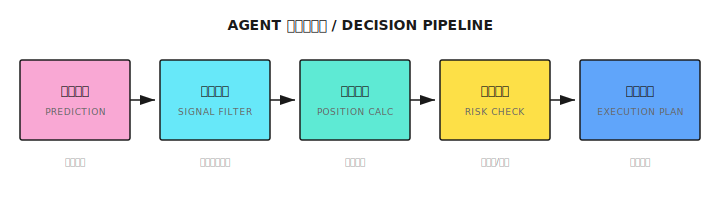
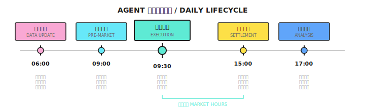
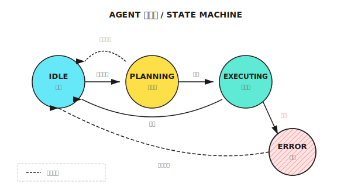
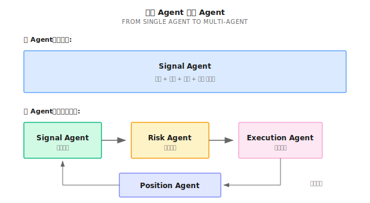

# 第10课：从模型到Agent

## 模型的局限

"模型只负责'预测'，而 Agent 需要负责'决策'。" 决策涉及四个核心问题：买什么、买多少、什么时候买卖、出问题怎么办。

---

## 10.1 预测 vs 决策

### 核心差异

| 维度 | 预测模型 | 交易 Agent |
|------|----------|------------|
| **输入** | 特征向量 | 特征 + 状态 + 约束 |
| **输出** | 预测值/概率 | 具体行动 |
| **评估** | IC, MSE | 收益/风险/成本 |
| **时间** | 单点预测 | 持续决策 |
| **错误处理** | 无 | 必须有 |

### Agent 的决策链



模型输出示例：
```
"AAPL 明天预期收益率 +0.5%，置信度 60%"

Agent 需要回答：
  1. 买入吗？ → 对比其他股票，考虑当前持仓
  2. 买多少？ → 资金、风险限制、相关性
  3. 什么价买？→ 市价单还是限价单？
  4. 止损在哪？→ 预测错了，亏多少离场？
  5. 卖出时机？→ 目标价、持有期限、动态止盈？
```

---

## 10.2 Agent 的核心组件

### 状态 (State)

| 状态类型 | 内容示例 |
|----------|----------|
| **市场状态** | 当前价格、波动率、成交量、趋势/震荡 |
| **持仓状态** | 持有什么、成本价、盈亏、持仓时长 |
| **账户状态** | 可用资金、保证金、已用杠杆 |
| **系统状态** | API 正常？延迟多少？有无告警？ |

### 行动空间 (Action Space)

```
基础行动：
  - BUY(symbol, quantity, order_type, price)
  - SELL(symbol, quantity, order_type, price)
  - HOLD()

复合行动：
  - REBALANCE(target_weights)
  - REDUCE_RISK(target_exposure)
  - CLOSE_ALL()

约束条件：
  - 单笔不超过可用资金的 10%
  - 总杠杆不超过 2 倍
  - 单一股票不超过总仓位的 20%
```

### 决策函数

```
action = decide(state, prediction, constraints)
```

---

## 10.3 仓位管理：从预测到头寸

### 等权分配

每只股票分配 1/N 的资金。问题：未考虑预测强度、波动率差异、相关性。

### 按预测强度分配

```
预测收益：AAPL +1.0%, MSFT +0.5%, GOOGL +0.3%
权重：AAPL 56%, MSFT 28%, GOOGL 16%
```
问题：高波动股票可能权重过高。

### 按波动率调整（风险平价）

让每只股票贡献相等的风险，使用波动率倒数权重：

```
波动率：AAPL 25%, MSFT 20%, GOOGL 15%
权重倒数：4, 5, 6.67 → 归一化后：26%, 32%, 42%
```

### Kelly 公式

```
Kelly 比例 = p/a - q/b
p = 胜率, q = 1-p, a = 平均亏损率, b = 平均盈利率

示例：胜率55%，盈亏比1.5:1
Kelly = 0.55 - 0.30 = 25%
实际应用：使用半 Kelly (12.5%)
```

### Half-Kelly + Van Tharp 混合模型（推荐）

| 方法 | 角色 | 目的 |
|------|------|------|
| **Half-Kelly** | 进攻端 - 设置上限 | 最大化长期复合增长 |
| **Van Tharp R-Multiple** | 防守端 - 设置下限 | 单笔亏损永不致命 |

**公式：**

```python
def half_kelly(win_rate: float, reward_risk_ratio: float) -> float:
    full_kelly = (win_rate * (reward_risk_ratio + 1) - 1) / reward_risk_ratio
    return max(0, full_kelly / 2)

def van_tharp_limit(equity, risk_pct, stop_loss_dist, price) -> float:
    max_loss = equity * risk_pct
    shares = max_loss / stop_loss_dist
    return (shares * price) / equity

# 最终仓位 = 三者取最小
final_position = min(strategy_cap, risk_cap, max_notional_per_pair)
```

**示例计算：**

```
账户: $100,000，AAPL $200，止损 $190（距离 $10）
胜率 55%，盈亏比 1.5:1

Half-Kelly: 18.75% → $18,750
Van Tharp: 100股 × $200 = $20,000
硬限制: 5% = $5,000

最终仓位 = min($18,750, $20,000, $5,000) = $5,000 → 买入25股
```

核心原则："Half-Kelly 定义进攻上限；Van Tharp R-Multiple 定义生存下限。"

---

## 10.4 风险控制集成

### Agent 内置的风险规则

| 规则类型 | 示例 | 触发动作 |
|----------|------|----------|
| **止损** | 单笔亏损 >5% | 平仓 |
| **止盈** | 单笔盈利 >10% | 减仓50% |
| **总回撤** | 账户回撤 >15% | 停止开仓 |
| **集中度** | 单股 >25% | 禁止加仓 |
| **时间** | 持仓 >20天 | 强制平仓 |

---

## 10.5 异常处理

### 必须处理的异常

| 异常类型 | 发生场景 | 处理方式 |
|----------|----------|----------|
| **订单拒绝** | 资金不足、标的停牌 | 记录日志、调整计划 |
| **部分成交** | 流动性不足 | 决定是否继续追单 |
| **价格跳空** | 隔夜大涨大跌 | 重新评估止损价 |
| **API 超时** | 网络问题 | 重试机制 + 熔断 |
| **数据缺失** | 数据源故障 | 备用数据源或暂停 |

### 设计原则

1. **快速失败**：不确定时停止，而非继续执行
2. **降级运行**：主功能失败时有备选方案
3. **人工介入**：严重异常触发告警
4. **事后审计**：所有异常都记录，便于复盘

---

## 10.6 Agent 的生命周期





状态机包含以下状态转换：初始化 → 数据采集 → 信号生成 → 风控检查 → 订单执行 → 持仓监控 → 异常处理（循环）。

---

## 10.7 多智能体视角



### Signal Agent 的定位

```
Signal Agent 职责：
  - 运行预测模型，生成原始信号
  - 初步仓位计算，信号置信度评估

Signal Agent 不负责：
  - 最终下单决策（Risk Agent）
  - 订单执行（Execution Agent）
  - 持仓监控（Position Agent）
```

---

## 代码实现

```python
from dataclasses import dataclass
from typing import Dict, List, Optional
from enum import Enum

class OrderType(Enum):
    MARKET = "market"
    LIMIT = "limit"

@dataclass
class Order:
    symbol: str
    quantity: int
    side: str  # "buy" or "sell"
    order_type: OrderType
    price: Optional[float] = None

@dataclass
class Position:
    symbol: str
    quantity: int
    avg_cost: float
    current_price: float

    @property
    def pnl_pct(self) -> float:
        return (self.current_price - self.avg_cost) / self.avg_cost

class TradingAgent:
    def __init__(self, capital, max_position_pct=0.2,
                 max_total_exposure=0.8, stop_loss_pct=0.05):
        self.capital = capital
        self.max_position_pct = max_position_pct
        self.max_total_exposure = max_total_exposure
        self.stop_loss_pct = stop_loss_pct
        self.positions: Dict[str, Position] = {}

    def get_current_exposure(self) -> float:
        total_value = sum(
            pos.quantity * pos.current_price
            for pos in self.positions.values()
        )
        return total_value / self.capital

    def calculate_position_size(self, symbol, prediction,
                                 volatility, current_price) -> int:
        current_exposure = self.get_current_exposure()
        remaining_exposure = self.max_total_exposure - current_exposure
        if remaining_exposure <= 0:
            return 0

        raw_weight = abs(prediction)
        vol_adjusted_weight = raw_weight / volatility
        capped_weight = min(vol_adjusted_weight,
                            self.max_position_pct, remaining_exposure)
        position_value = self.capital * capped_weight
        return int(position_value / current_price)

    def check_stop_loss(self) -> List[Order]:
        orders = []
        for symbol, pos in self.positions.items():
            if pos.pnl_pct < -self.stop_loss_pct:
                orders.append(Order(symbol=symbol, quantity=pos.quantity,
                                    side="sell", order_type=OrderType.MARKET))
        return orders

    def generate_orders(self, predictions, volatilities, prices) -> List[Order]:
        orders = []
        orders.extend(self.check_stop_loss())

        for symbol, pred in predictions.items():
            if pred > 0.001:
                target_shares = self.calculate_position_size(
                    symbol, pred,
                    volatilities.get(symbol, 0.2),
                    prices[symbol]
                )
                current_shares = self.positions.get(
                    symbol, Position(symbol, 0, 0, 0)).quantity
                diff = target_shares - current_shares

                if diff > 0:
                    orders.append(Order(symbol=symbol, quantity=diff,
                                        side="buy", order_type=OrderType.LIMIT,
                                        price=prices[symbol] * 0.999))
                elif diff < 0:
                    orders.append(Order(symbol=symbol, quantity=-diff,
                                        side="sell", order_type=OrderType.LIMIT,
                                        price=prices[symbol] * 1.001))
        return orders
```

---

## 本课要点回顾

- 理解预测模型和交易 Agent 的核心差异
- 掌握 Agent 的核心组件：状态、行动空间、决策函数
- 学会多种仓位管理方法：等权、预测加权、风险平价、Kelly
- 认识必须处理的异常类型和处理原则
- 理解 Signal Agent 在多智能体系统中的定位

---

## 场景练习答案

给定：AAPL +1.2%/25%波动率，TSLA +0.8%/50%波动率，MSFT +0.5%/20%波动率，资金$100,000，最大单仓20%

```
波动率倒数：AAPL=4, TSLA=2, MSFT=5，总和=11

归一化权重：
  AAPL: 36.4% → $36,400 → $20,000（触限）
  TSLA: 18.2% → $18,200
  MSFT: 45.4% → $45,400 → $20,000（触限）

最终：AAPL $20k, TSLA $18.2k, MSFT $20k，总仓位 58.2%
```