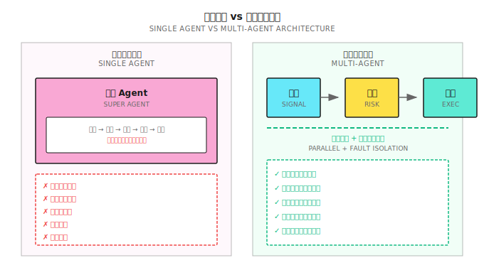
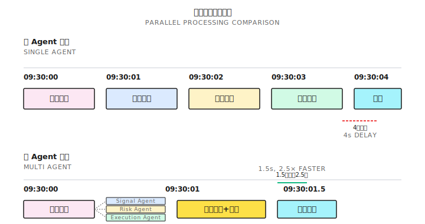
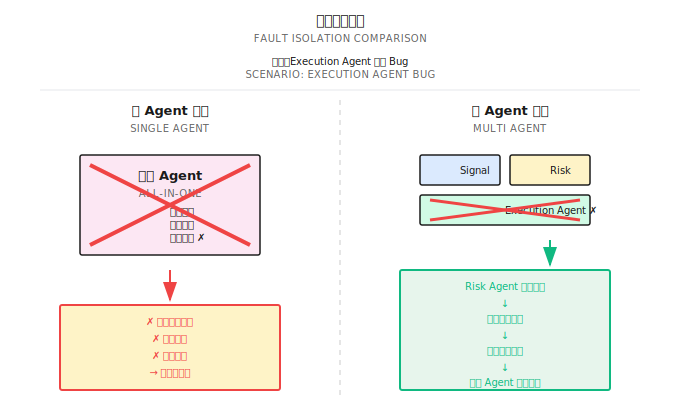
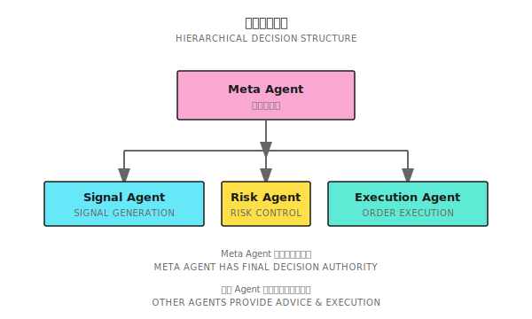
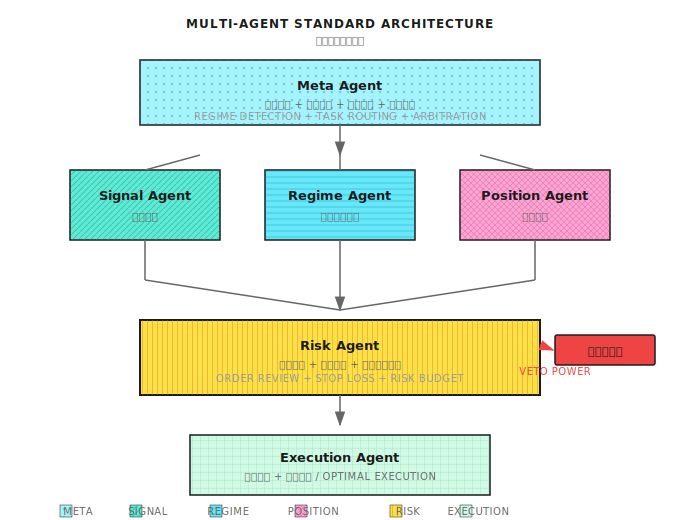

# 第11课：为什么需要多智能体

## 前言

> "一个人不可能同时是外科医生、律师和飞行员。交易系统也一样——专业分工才能做到极致。"

---

## 全能选手的困境

2018年某量化团队开发了一个"全能Agent"，回测年化45%、夏普2.3、最大回撤12%，上线后三个月暴露出以下问题：

| 问题 | 根因 |
|------|------|
| 信号延迟 | 串行处理，无法并行 |
| 风控失效 | 一个模块出问题，全部阻塞 |
| 难以调试 | 职责混在一起，无法定位 |
| 无法改进 | 紧耦合，牵一发动全身 |

---

## 11.1 单Agent的结构性缺陷



| 缺陷 | 影响 |
|------|------|
| 无法并行 | 错过时效性机会 |
| 单点故障 | 风险失控 |
| 难以专精 | 整体表现平庸 |
| 调试困难 | 复盘低效 |
| 扩展受限 | 迭代缓慢 |

---

## 11.2 多智能体的核心优势

### 优势1：专业分工

每个Agent只做一件事：

| Agent | 专精领域 | 评估指标 |
|-------|---------|---------|
| Signal Agent | 预测未来收益 | IC, IR, 方向准确率 |
| Risk Agent | 保护资金安全 | 最大回撤, VaR |
| Execution Agent | 最优成交价 | 滑点, 成交率 |
| Regime Agent | 识别市场状态 | 切换准确率, 延迟 |

### 优势2：并行处理

- 单Agent：串行处理，总耗时4秒
- 多Agent：并行处理，总耗时1.5秒，**快2.5倍**



### 优势3：故障隔离

- 单Agent：一个模块故障导致整个系统瘫痪
- 多Agent：故障被隔离，Risk Agent可独立触发熔断



### 优势4：独立迭代

```
单Agent优化执行：
  改动 → 担心影响信号 → 全量测试 → 迭代周期2周

多Agent优化执行：
  只改Execution Agent → 接口不变 → 单独测试 → 迭代周期2天
```

---

## 11.3 多智能体的协作机制

### 通信模式

| 模式 | 适用场景 | 示例 |
|------|---------|------|
| 请求-响应 | 需要确认的操作 | Signal→Risk: "能买AAPL吗？" |
| 发布-订阅 | 广播通知 | Data Agent发布新行情 |
| 队列 | 异步处理 | 订单队列逐个处理 |
| 共享状态 | 需要一致视图 | 所有Agent共享持仓状态 |

### 决策仲裁

**方案1：层级结构** — Meta Agent有最终决策权



**方案2：投票机制**
```
Signal Agent: 买入 AAPL (+1票)
Risk Agent: 不买，集中度超限 (-1票)
Regime Agent: 当前趋势市 (+1票)
投票结果: +1，执行买入（可能缩小仓位）
```

**方案3：一票否决** — Risk Agent说"不"，交易就不执行

### 责任边界

> **黄金法则**：每个Agent只关心自己的职责，信任其他Agent做好自己的工作。

---

## 11.4 多智能体架构设计



### 各Agent职责

| Agent | 输入 | 输出 | 关键指标 |
|-------|------|------|---------|
| Data Agent | 外部数据源 | 清洗后的数据 | 延迟、完整性 |
| Signal Agent | 特征 | 预测收益/排名 | IC, IR |
| Regime Agent | 价格、波动率 | 当前市场状态 | 准确率、切换延迟 |
| Risk Agent | 待执行订单 | 批准/拒绝/调整 | 阻止的亏损 |
| Execution Agent | 批准的订单 | 成交报告 | 滑点、成交率 |
| Meta Agent | 全局状态 | 调度指令 | 系统健康度 |

---

## 11.5 多智能体的失效场景

### 何时多Agent反而更差？

| 场景 | 原因 | 更好选择 |
|------|------|---------|
| 策略极简 | 规则就几条 | 单脚本即可 |
| 低延迟要求 | 通信有1-10ms开销 | 单进程优化 |
| 团队太小 | 1人无法维护多Agent | 先用单Agent验证 |
| 协调成本>收益 | 通信复杂度爆炸 | 减少Agent数量 |

### 常见问题

| 问题 | 解决方案 |
|------|---------|
| 死锁 | 超时机制+优先级 |
| 消息丢失 | 确认机制+重试 |
| 状态不一致 | 共享状态+同步机制 |
| 雪崩故障 | 熔断+降级 |

---

## 11.6 渐进式演进路径

> **实践原则**：先在一个进程里把事做对。模块边界从第一天就要清晰，部署边界可以延后。

```
阶段1：单Agent（验证策略可行性）
阶段2：Signal + Risk分离（一票否决）
阶段3：加入Execution Agent
阶段4：加入Regime Agent
阶段5：完整架构（含Meta Agent、Data Agent、Position Agent）
```

### 阶段升级标准

| 阶段 | 验收标准 |
|------|---------|
| 1→2 | 策略Sharpe>1，需要更严格风控 |
| 2→3 | 滑点成本>收益的10% |
| 3→4 | 不同市场状态表现差异大 |
| 4→5 | 系统复杂度需要统一调度 |

---

## 设计练习解答

**场景**：年化25%、最大回撤18%、震荡市亏损、滑点占收益15%

**推荐演进顺序**：
1. **首先**拆分Risk Agent（回撤18%太高，风控优先）
2. **其次**加入Regime Agent（解决震荡市亏损）
3. **最后**拆分Execution Agent（优化15%滑点）

> **理由**：先保护资金，再提升收益。

---

## 本课要点

- 单Agent的5个结构性缺陷
- 多Agent的4个核心优势：专业分工、并行处理、故障隔离、独立迭代
- 3种决策仲裁机制：层级结构、投票、一票否决
- 多Agent的失效场景
- 从单Agent到多Agent的渐进演进路径
