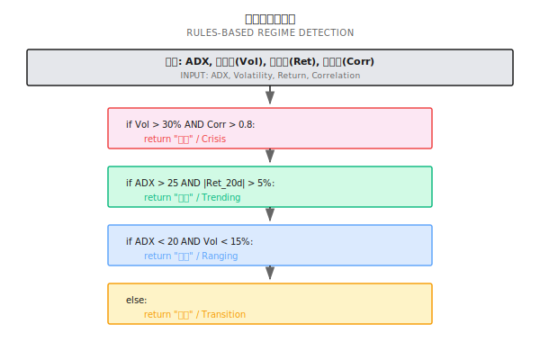
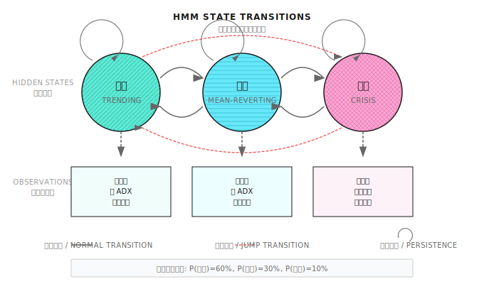
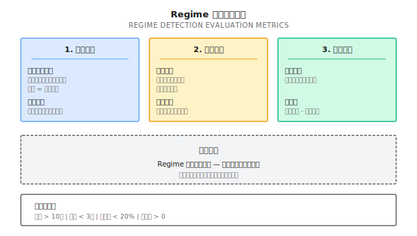
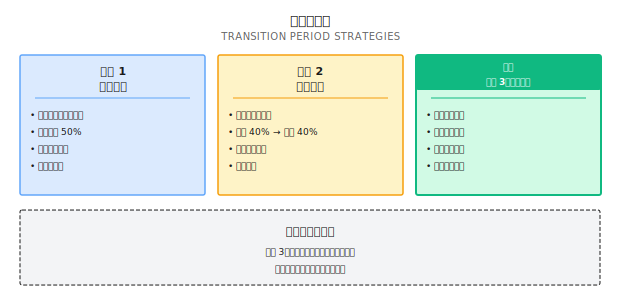
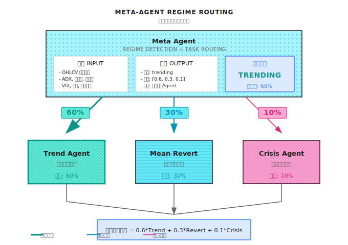

# 第12课：市场状态识别

## 一个典型场景（示意）

两套策略（趋势跟随和均值回归）在固定50/50权重下，全年收益互相抵消接近零。加入Regime Detection模块后，动态调整权重，全年收益达18%，夏普比率1.6。

"差距在哪？不是策略本身，而是**知道什么时候用什么策略**。"

---

## 12.1 什么是市场状态（Regime）

### 三种基本状态

| 状态 | 特征 | 最佳策略 | 典型持续时间 |
|------|------|----------|--------------|
| **趋势市** | 价格持续单向运动，波动率上升 | 动量/趋势跟随 | 数周到数月 |
| **震荡市** | 价格在区间内波动 | 均值回归/网格 | 数周到数月 |
| **危机市** | 剧烈波动，相关性飙升，流动性枯竭 | 风控优先/现金为王 | 数天到数周 |

### 为什么识别状态这么难？

| 挑战 | 解释 |
|------|------|
| **后视镜问题** | 事后看状态很清楚，实时看很模糊 |
| **边界模糊** | 趋势和震荡之间没有清晰分界线 |
| **状态嵌套** | 日线震荡、周线趋势可以同时存在 |
| **检测滞后** | 等你确认状态时，可能已经快结束了 |
| **误切换成本** | 频繁切换策略本身就是成本 |

### 纸上练习：识别历史状态

| 时期 | 20日收益率 | 20日波动率 | ADX | 判断 |
|------|-----------|-----------|-----|------|
| A | +12% | 18% | 35 | **趋势市（上涨）**：高收益+中等波动+高ADX(>25) |
| B | -2% | 8% | 15 | **震荡市**：低收益+低波动+低ADX(<20) |
| C | -25% | 45% | 28 | **危机市**：大幅下跌+极高波动(>30%) |
| D | +3% | 12% | 22 | **弱趋势/过渡期**：收益和ADX都在中间地带 |

**关键发现**：D时期最难判断，大部分时间市场都在"灰色地带"。

---

## 12.2 Regime 检测的四种方法

### 方法对比

| 方法 | 原理 | 优点 | 缺点 | 适用场景 |
|------|------|------|------|----------|
| **规则法** | 用指标阈值判断 | 简单、可解释、无滞后 | 阈值难选、边界硬 | 快速原型、基线 |
| **统计法** | 用统计检验识别结构变化 | 数学严谨 | 需要历史数据、有滞后 | 离线分析 |
| **机器学习** | 用ML模型分类 | 可捕捉复杂模式 | 需要标签、过拟合风险 | 有足够标注数据时 |
| **隐马尔可夫** | 假设状态服从马尔可夫链 | 能估计状态概率 | 假设可能不成立 | 状态数已知时 |

### 方法一：规则法（最实用）



纸上练习答案：

| 场景 | ADX | 20日波动率 | 20日收益率 | 资产相关性 | 状态 |
|------|-----|-----------|-----------|-----------|------|
| 1 | 32 | 22% | +8% | 0.4 | **趋势市**：Vol<30%→ADX>25且Ret>5% |
| 2 | 18 | 12% | -1% | 0.3 | **震荡市**：Vol<30%→ADX<20且Vol<15% |
| 3 | 25 | 38% | -15% | 0.85 | **危机市**：Vol>30%且Corr>0.8 |
| 4 | 23 | 18% | +3% | 0.5 | **过渡期**：ADX=23在20-25之间，不满足明确条件 |

### 方法二：隐马尔可夫模型（HMM）



HMM核心输出：
- **状态概率**：当前处于每个状态的概率（如趋势60%、震荡30%、危机10%）
- **转移概率**：从一个状态切换到另一个状态的概率

纸上练习——状态概率 55%趋势/35%震荡/10%危机 的权重方案：

| 方案 | 趋势策略 | 均值回归 | 风控策略 | 问题 |
|------|---------|---------|---------|------|
| 硬切换 | 100% | 0% | 0% | 忽略了35%的震荡概率 |
| 概率加权 | 55% | 35% | 10% | 更稳健，但危机时反应不够快 |
| 调整后加权 | 50% | 30% | 20% | 放大危机权重作为保险 |

**关键洞察**：状态概率不应直接用作策略权重，需根据风险偏好调整。

```python
# 注意：以下为示意代码，展示 HMM 的基本用法
# 需要安装 hmmlearn: pip install hmmlearn

import numpy as np
from hmmlearn import hmm

class RegimeDetector:
    """基于 HMM 的市场状态检测器"""

    def __init__(self, n_states: int = 3):
        self.n_states = n_states
        self.model = hmm.GaussianHMM(
            n_components=n_states,
            covariance_type="full",
            n_iter=100
        )

    def fit(self, features: np.ndarray):
        """
        训练 HMM 模型

        features: shape (n_samples, n_features)
                  通常包括：收益率、波动率、ADX 等
        """
        self.model.fit(features)
        return self

    def predict_proba(self, features: np.ndarray) -> np.ndarray:
        """
        预测当前状态概率

        返回: shape (n_states,) 的概率分布
        """
        posteriors = self.model.predict_proba(features)
        return posteriors[-1]  # 最新时刻的概率

    def get_regime(self, features: np.ndarray, threshold: float = 0.5) -> str:
        """
        获取当前状态（带置信度阈值）
        """
        probs = self.predict_proba(features)
        max_prob = np.max(probs)
        max_state = np.argmax(probs)

        if max_prob < threshold:
            return "uncertain"

        state_names = ["trending", "mean_reverting", "crisis"]
        return state_names[max_state]
```

### 方法三：波动率聚类（实用变体）

| 波动率区间 | 状态 | 策略建议 |
|-----------|------|---------|
| < 15% | 低波动（震荡） | 均值回归、卖期权 |
| 15% - 25% | 正常波动 | 正常运行 |
| 25% - 35% | 高波动（趋势） | 趋势跟随、减仓 |
| > 35% | 极高波动（危机） | 风控优先、大幅减仓 |

波动率重要原因：
- 波动率是市场"体温"，能快速反映市场健康状态
- 波动率有聚集效应（高波动后往往还是高波动）
- 波动率比收益率更容易预测

---

## 12.3 Regime 检测的评估



评估标准不是"准确率"，而是**有没有帮策略赚更多钱**。

### 纸上练习：计算 Regime 检测的价值

| 方案 | 年化收益 | 最大回撤 | 夏普比率 |
|------|---------|---------|---------|
| 无Regime（固定50/50） | 8% | 18% | 0.6 |
| 有Regime（动态切换） | 15% | 12% | 1.2 |
| 切换成本（24次×0.5%） | -12% | - | - |

**答案**：
1. **净增值计算**：毛收益提升7%，切换成本=24×0.5%=12%，**净增值=-5%**（反而亏了！）
2. 误切换率降到10%：节省约1.2%，净增值=-3.8%（仍为负）
3. 解决切换成本高的方法：
   - **渐进切换**：50%→70%→90%
   - **确认延迟**：状态连续N天才切换
   - **软切换**：用概率加权而非硬切换
   - **降低频率**：只在状态非常明确时才切换

**关键教训**：Regime检测的价值 = 识别准确性 × 策略差异 - 切换成本

### 切换滞后的代价

| 滞后天数 | 在趋势市的影响 | 在危机市的影响 |
|---------|-------------|-------------|
| 1天 | 错过约5%的行情 | 多承受约3%的损失 |
| 3天 | 错过约15%的行情 | 多承受约10%的损失 |
| 5天 | 错过约25%的行情 | 可能错过止损时机 |
| 10天 | 趋势可能已经过半 | 危机可能已经结束 |

**结论**：宁可有一些误判，也不要滞后太多。**危机检测必须快。**

---

## 12.4 常见误区

**误区一：Regime Detection准确率越高越好**
评估标准不是"准确率"，而是"有没有帮策略赚更多钱"。

**误区二：趋势/震荡是二元判断**
现实中大部分时间市场处于"灰色地带"，强行二元判断导致频繁误切换。正确做法：用概率加权（趋势60%/震荡40%）或承认"过渡期"。

**误区三：检测到状态变化就立即切换策略**
切换本身有成本，频繁切换可能亏掉所有收益。正确做法：确认延迟+渐进切换。

**误区四：危机检测可以"等确认"**
危机检测必须快。宁可误判为危机（少赚），也不要漏判（巨亏）。

---

## 12.5 过渡期处理

### 过渡期的特征

| 特征 | 表现 |
|------|------|
| 指标矛盾 | ADX说趋势，波动率说震荡 |
| 概率模糊 | HMM输出40%/35%/25%，没有明显主导 |
| 信号冲突 | 趋势策略和均值回归策略给出相反信号 |

### 过渡期策略



三种方案：
- **策略1**：等待确认（保持当前状态不切换）
- **策略2**：平均分配（各策略等权重）
- **策略3（推荐）**：风险优先（降低整体仓位，以风控为主）

---

## 12.5 多智能体视角



Regime Detection是**Meta Agent的核心能力**。

### Regime Agent 的职责

| 职责 | 具体内容 | 触发条件 |
|------|---------|---------|
| **状态识别** | 判断当前市场处于什么状态 | 每日/每小时 |
| **信号路由** | 决定把任务分发给哪个专家Agent | 状态变化时 |
| **权重分配** | 根据状态概率分配专家权重 | 持续 |
| **切换控制** | 防止过度切换，管理过渡期 | 状态模糊时 |
| **回顾归因** | 记录状态判断，用于事后分析 | 持续 |

### 与其他 Agent 的协作

| 协作对象 | 协作方式 |
|---------|---------|
| **Signal Agent** | 接收Regime信号，调整策略参数 |
| **Risk Agent** | 危机状态时，Risk Agent获得更大否决权 |
| **Execution Agent** | 状态切换时，负责平滑调仓 |
| **Evolution Agent** | 提供状态识别的历史准确率，用于模型进化 |

---

## 验收标准

| 验收项 | 达标标准 | 自测方法 |
|--------|---------|---------|
| 理解三种状态 | 能描述趋势/震荡/危机的特征和最佳策略 | 用自己的话解释 |
| 掌握规则法 | 能用ADX/波动率/相关性设计判断规则 | 完成纸上练习 |
| 理解HMM原理 | 能解释状态概率的含义和用法 | 解释为什么不直接用概率做权重 |
| 评估检测价值 | 能计算净增值=收益提升-切换成本 | 完成评估练习 |
| 处理过渡期 | 能说出三种过渡期策略及其适用场景 | 给出你的选择和理由 |

### 综合练习

设计你的Regime检测系统：
1. 选择检测方法（规则法/HMM/其他）并说明理由
2. 定义输入特征和阈值
3. 设计过渡期处理策略
4. 设定切换确认条件（防止过度切换）
5. 定义评估指标

---

## 本课交付物

1. **Regime检测的设计框架** - 从方法选择到评估指标的完整思路
2. **规则法的实用模板** - 可直接使用的ADX/波动率/相关性判断规则
3. **评估Regime检测价值的方法** - 净增值=收益提升-切换成本
4. **过渡期处理策略** - 三种方案及其适用场景

---

## 本课要点回顾

- 理解市场状态（Regime）的概念及其对策略选择的影响
- 掌握四种Regime检测方法：规则法、统计法、ML、HMM
- 理解Regime检测的评估不是"准确率"而是"经济价值"
- 掌握过渡期的处理策略
