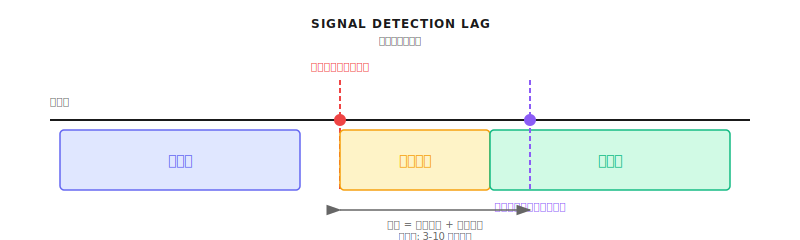
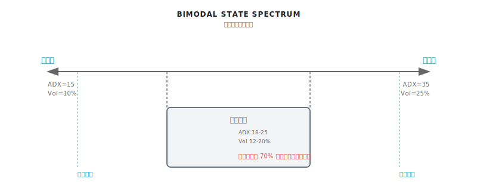
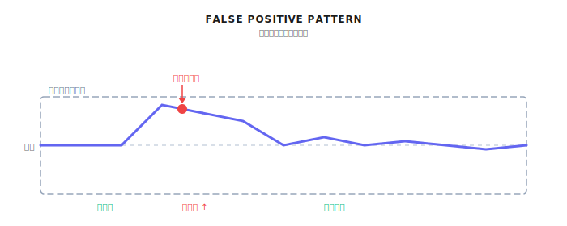
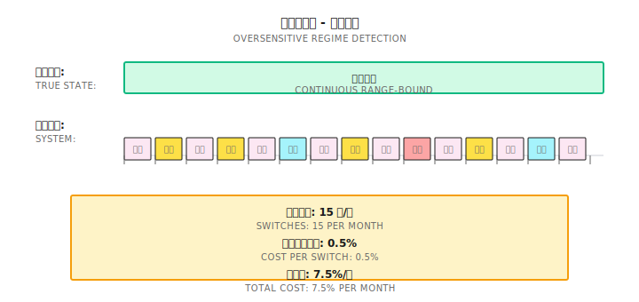
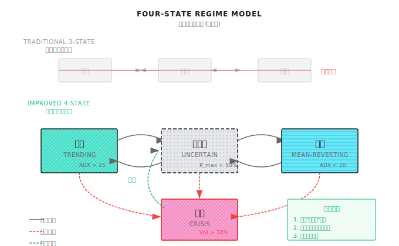
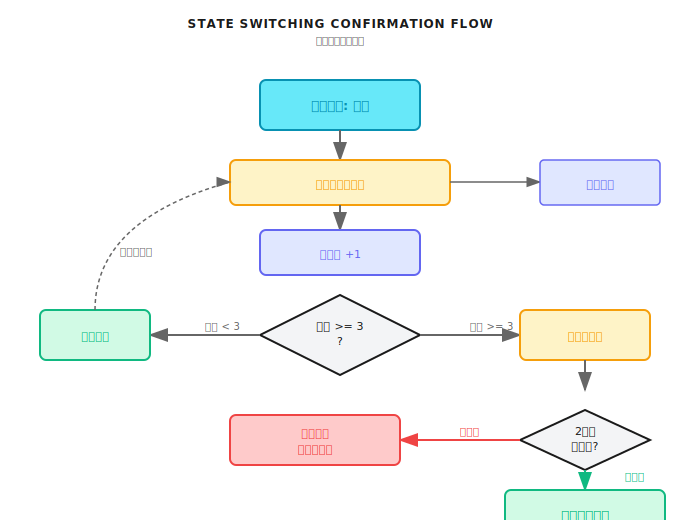
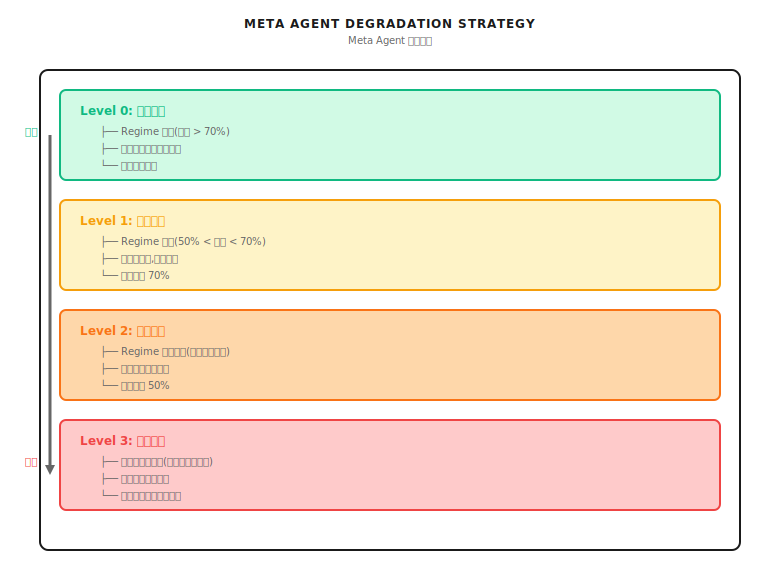

# 第13课：Regime误判与系统性崩溃模式

## 核心观点
"最大回撤往往来自：错误的状态判断 + 错误的策略被激活。"

---

## 一个典型场景（示意）

2020年2月，某量化基金的Regime检测系统判断为"震荡市"，激活均值回归策略，在下跌时持续加仓。3月市场崩盘后，系统确认危机时已深度套牢，最终从高点回撤32%，比持有指数多亏7%。

| 日期 | 标普500 | 系统判断 | 结果 |
|------|---------|---------|------|
| 2/20 | 3,373 | 震荡市 | 正常持仓 |
| 2/24 | 3,225(-4.4%) | 震荡市 | 加仓，亏损 |
| 3/12 | 2,480(-9.5%) | 危机市！ | 触发止损，损失25% |
| 4/9 | 2,789(+24.7%) | 过渡期 | 观望，错过反弹 |

**根本原因：**
1. 检测滞后——从"震荡"切换到"危机"用了3周
2. 错误策略被激活
3. 止损太晚，恢复太慢

---

## 13.1 为什么Regime检测一定会错

### 13.1.1 不可避免的滞后性



任何检测方法都需要观察历史数据才能判断。

**滞后的代价（假设5天内下跌15%）：**

| 滞后天数 | 确认危机时间 | 已亏损 | 还能保住 |
|---------|------------|--------|---------|
| 1天 | 第2天 | -3% | 12% |
| 3天 | 第4天 | -9% | 6% |
| 5天 | 第6天 | -15% | 0% |

结论：3天的滞后可能意味着错过60%的止损机会。

### 13.1.2 后视镜问题

```
事后看:  ────────────────────┬──────────────────────
                             │
         明显是震荡市         │      明显是趋势市

实时看:  ╶╶╶╶╶╶╶╶╶╶╶╶╶╶╶╶╶╶┼╶╶╶╶╶╶╶╶╶╶╶╶╶╶╶╶╶╶╶╶╶╶╶
                             │
         这是震荡结束？       │   这只是假突破？
         还是趋势开始？       │   还是真趋势？
```

回测时知道未来，实盘时不知道。

### 13.1.3 边界模糊性



市场状态不是离散开关，而是连续光谱。

---

## 13.2 五种典型误判模式

### 13.2.1 模式一：False Positive（把震荡判成趋势）



- ADX短暂突破25，连续3天上涨5%
- 系统激活动量策略
- 实际只是震荡区间内正常波动
- **损失来源**：高位追涨、频繁止损、策略切换摩擦成本

### 13.2.2 模式二：False Negative（把趋势判成震荡）

- 趋势刚开始，ADX还在20以下
- 激活均值回归策略，下跌时不断抄底
- 越抄越深（即开篇案例）

### 13.2.3 模式三：滞后型误判

| 时间点 | 真实状态 | 系统判断 | 是否错位 |
|--------|---------|---------|---------|
| T | 趋势开始 | 震荡 | ✗ |
| T+3 | 趋势中段 | 过渡期 | ✗ |
| T+7 | 趋势末期 | 趋势确认！ | ✗ |
| T+10 | 趋势结束 | 趋势 | ✗ |

方向正确，但时机全错。

### 13.2.4 模式四：过敏型误判

对噪音过度敏感，频繁切换状态。

- 每次切换成本0.5% × 15次 = 7.5%/月
- 策略没有时间发挥作用
- 月度总成本可能吞噬所有alpha



### 13.2.5 模式五：边界震荡型误判

```
阈值线(ADX=25): ─────────────────────────────────────────
                           ↑  ↓  ↑  ↓  ↑↓
实际ADX:        ─────/\─/\─/\─/\─\/────────────────
                       24 26 24 26 2324

系统状态:           震 趋 震 趋 震趋震
                    荡 势 荡 势 荡势荡
```

---

## 13.3 误判的量化代价

### 13.3.1 误判成本模型

```
总误判成本 = 直接损失 + 机会成本 + 切换成本

其中:
  直接损失 = Σ(错误策略在错误状态下的亏损)
  机会成本 = Σ(正确策略在正确状态下本应赚的钱)
  切换成本 = 切换次数 × 单次切换成本
```

### 13.3.2 历史案例分析

**2020年3月暴跌：**

| 策略类型 | 正确判断 | 错误判断 | 差距 |
|---------|---------|---------|------|
| 动量策略 | -5% | -25% | 20% |
| 均值回归 | -8% | -35% | 27% |
| 风险平价 | -12% | -18% | 6% |

**2022年加息周期：**

| 月份 | 正确判断 | 错误判断 | 差距原因 |
|------|---------|---------|---------|
| 1月 | 识别趋势反转 | 仍认为牛市 | 高位没减仓 |
| 3月 | 确认下跌趋势 | 认为是回调 | 继续抄底 |
| 6月 | 维持防御 | 认为底部 | 再次抄底失败 |

### 13.3.3 纸上练习：计算误判敏感度

不同状态组合下的预期月收益：

| 实际状态 | 激活策略 | 月收益 |
|---------|---------|--------|
| 趋势 | 趋势策略 | +5% |
| 趋势 | 均值回归 | -8% |
| 震荡 | 趋势策略 | -3% |
| 震荡 | 均值回归 | +3% |
| 危机 | 趋势策略 | -15% |
| 危机 | 均值回归 | -25% |
| 危机 | 防御策略 | -5% |

**分析框架（70%准确率假设）：**
- 假设状态分布：趋势30%，震荡50%，危机20%
- 正确识别综合月收益 ≈ 1.4%
- 含30%误判后综合月收益 ≈ 0.5%

**结论**：30%误判率可能导致收益减少65%。

---

## 13.4 设计"不确定状态"

### 13.4.1 从三状态到四状态



在趋势、震荡、危机之外，增加第四状态：**不确定**。

### 13.4.2 "不确定"状态的触发条件

| 触发条件 | 解释 |
|---------|------|
| HMM最高概率 < 50% | 没有一个状态占主导 |
| 多个指标矛盾 | ADX说趋势，波动率说震荡 |
| 刚发生状态切换 | 切换后N天内保持不确定 |
| 接近阈值边界 | ADX在22-28之间 |

### 13.4.3 "不确定"状态下的三种处理策略

```
策略1: 降仓观望
  确定状态时仓位: 100%
  不确定状态仓位:  50%
  等待状态明确后再恢复

策略2: 策略混合
  趋势概率40%, 震荡概率40%, 危机概率20%
  趋势策略权重: 40%
  均值回归权重: 40%
  防御策略权重: 20%

策略3: 最坏情况准备
  不确定 = 可能是危机前兆
  主动启动对冲
  收紧止损
  宁可错过机会，不可放大风险
```

### 13.4.4 状态切换的确认机制



```
状态切换规则:
1. 单次触发：记录但不切换
2. 连续N天触发：进入"待确认"
3. 待确认期无回撤：确认切换
4. 待确认期回撤：恢复原状态

参数建议:
- N = 3（快速响应）到 N = 5（稳健）
- 待确认期 = 2-3天
```

---

## 13.5 多智能体视角

### 13.5.1 Meta Agent的降级策略



当Regime检测不可靠时，系统需要fallback机制（四级降级）。

### 13.5.2 Regime Agent自身的健康监控

```
Regime Agent健康指标:

1. 稳定性指标
   - 状态切换频率 < 3次/周
   - 平均状态持续时间 > 5天

2. 一致性指标
   - 多个检测方法的一致率 > 70%
   - 与市场表现的吻合度（事后检验）

3. 及时性指标
   - 危机检测滞后 < 3天
   - 重大转折捕捉率 > 60%

4. 自检机制
   - 每日对比预测 vs 实际
   - 累计误判超阈值时自动降级
```

### 13.5.3 误判后的归因与学习

```
误判发生后的处理流程:

1. 识别误判
   ├── 策略亏损 + Regime变化 = 疑似误判
   └── 事后确认真实状态

2. 归因分析
   ├── 检测方法问题还是参数问题？
   ├── 滞后太多还是过于敏感？
   └── 单一指标失效还是系统性问题？

3. 反馈学习
   ├── 记录误判案例
   ├── 更新检测参数（在线学习）
   └── 频繁失效则考虑更换方法

4. 通知其他Agent
   ├── Risk Agent: 更新风险评估
   ├── Signal Agent: 调整信号阈值
   └── Evolution Agent: 纳入训练数据
```

---

## 验收标准

| 验收项 | 达标标准 | 自测方法 |
|--------|---------|---------|
| 理解滞后性 | 能解释Regime检测为何有滞后 | 给出滞后来源 |
| 识别五种误判 | 能描述每种误判特征和损失来源 | 举例说明 |
| 量化误判成本 | 能用框架估算误判的收益影响 | 完成纸上练习 |
| 设计不确定状态 | 能说出触发条件和处理策略 | 设计一个规则 |
| 理解降级机制 | 能描述Meta Agent的四级降级策略 | 画出降级流程 |

---

## 本课要点回顾

- Regime检测一定会有滞后，由方法论决定
- 五种典型误判：False Positive、False Negative、滞后型、过敏型、边界震荡型
- 最大回撤往往来自：错误状态 + 错误策略被激活
- 引入"不确定"状态可以减少强制分类的错误
- Meta Agent需要有完善的降级策略
