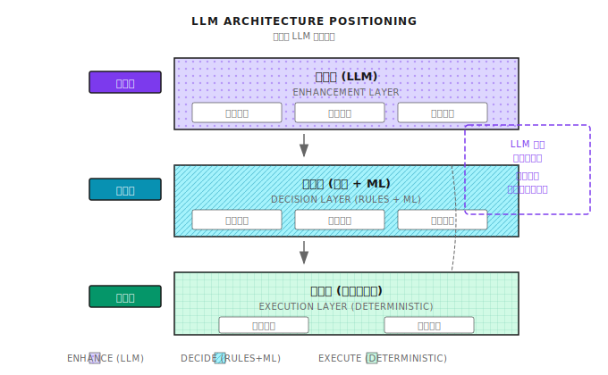
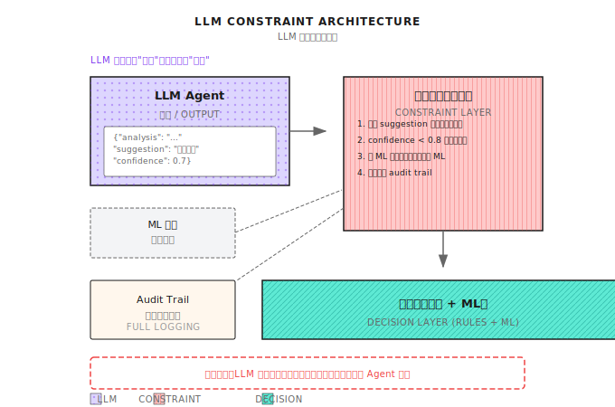

# 第14课：LLM在量化中的应用

## 核心论点

> "LLM 是最强大的研究助理，但最差劲的交易员。"

---

## GPT 交易员的幻想与现实

2023年实验：让 GPT-4 直接做交易决策（提供价格数据、财经新闻、当前持仓）

**3个月结果对比：**

| 指标 | GPT-4策略 | 随机策略 | 标普500 |
|------|-----------|----------|---------|
| 收益率 | -12% | -3% | +8% |
| 夏普比率 | -0.8 | -0.2 | 0.5 |
| 最大回撤 | 25% | 18% | 10% |

**失败原因：**
1. 幻觉问题——编造不存在的"市场规律"
2. 数学能力弱——无法准确计算收益率、波动率
3. 无记忆——每次调用独立，无法积累经验
4. 高延迟——一次推理需要几秒
5. 不可复现——同样输入可能产生不同输出

**同期对比：** 用GPT-4做财报分析的团队：财报解读质量提升3倍，研究报告生成从4小时降到30分钟，新闻情感分析准确率85%。

---

## 14.1 LLM 的正确定位

### LLM 能做什么？

| 能力 | 量化应用 | 价值等级 |
|------|----------|----------|
| 文本理解 | 财报解读、新闻分析 | ⭐⭐⭐⭐⭐ |
| 信息抽取 | 从10-K中提取关键指标 | ⭐⭐⭐⭐⭐ |
| 生成报告 | 策略诊断报告、复盘总结 | ⭐⭐⭐⭐ |
| 代码生成 | 辅助写回测代码 | ⭐⭐⭐⭐ |
| 知识问答 | 解释金融概念 | ⭐⭐⭐ |

### LLM 不能做什么？

| 尝试 | 为什么失败 | 替代方案 |
|------|-----------|----------|
| 直接预测价格 | 无法访问实时数据，计算不准 | 传统ML模型 |
| 实时交易决策 | 延迟太高，不可复现 | 规则系统+ML |
| 精确计算 | 大数运算错误率高 | 专门计算模块 |
| 长期记忆 | 上下文有限 | 外部知识库 |

**核心原则：LLM 作为增强层**



---

## 14.2 新闻与情感分析

### 应用场景

| 新闻类型 | 提取内容 | 量化价值 |
|----------|----------|----------|
| 财报发布 | 超预期/低预期、指引调整 | 事件驱动信号 |
| 产品新闻 | 新品发布、召回、合作 | 基本面变化 |
| 宏观政策 | 利率决议、监管变化 | 系统性风险 |
| 分析师观点 | 评级变化、目标价调整 | 情绪指标 |

### 情感分析示例

**输入新闻：**
> Apple reported quarterly revenue of $123 billion, beating Wall Street expectations of $118 billion. However, iPhone sales in China declined 15% year-over-year...

**LLM 提取：**
```json
{
  "company": "AAPL",
  "event_type": "earnings",
  "sentiment_overall": 0.6,
  "key_points": [
    {"topic": "revenue", "sentiment": 0.8, "value": "beat by 4%"},
    {"topic": "china_iphone", "sentiment": -0.7, "value": "-15% YoY"}
  ],
  "trading_signal": "mixed",
  "confidence": 0.7
}
```

**使用原则：**
- 不直接交易，作为信号的输入特征之一
- 与价格动量、技术指标结合
- 用历史数据验证LLM情感的预测力（回测）

### 提示工程关键点

**差的提示：**
> 这条新闻是利好还是利空？

**好的提示：**
```
你是一个金融分析师。请分析以下新闻：
[新闻内容]

请按以下格式输出：
1. 涉及公司/资产（股票代码）
2. 事件类型（财报/产品/政策/其他）
3. 整体情感分数（-1 到 1）
4. 3 个关键信息点，每个包含主题、情感分数、具体数值
5. 对短期价格的可能影响（涨/跌/中性）
6. 置信度（0 到 1）

只输出 JSON，不要解释。
```

---

## 14.3 财报分析自动化

### 10-K/10-Q 信息抽取

| 提取内容 | 位置 | 用途 |
|----------|------|------|
| 收入增速 | Financial Statements | 基本面筛选 |
| 毛利率变化 | MD&A | 盈利能力趋势 |
| 风险因素变化 | Risk Factors | 风险预警 |
| 管理层讨论语气 | MD&A | 情绪指标 |
| 诉讼进展 | Legal Proceedings | 事件风险 |

### 结构化提取流程

```
┌─────────────────┐
│  下载 10-K PDF   │
└────────┬────────┘
         ↓
┌─────────────────┐
│   PDF → 文本    │
└────────┬────────┘
         ↓
┌─────────────────┐
│ 分段（按章节）   │
└────────┬────────┘
         ↓
┌─────────────────┐
│ LLM 逐段提取     │  ← 每段单独处理，避免上下文过长
└────────┬────────┘
         ↓
┌─────────────────┐
│ 结构化数据存储   │  → 数据库，供回测使用
└─────────────────┘
```

### 财报语气变化检测

| 上期表述 | 本期表述 | 信号 |
|----------|----------|------|
| "我们预期增长" | "我们保持谨慎乐观" | 语气转弱 |
| "面临挑战" | "面临重大挑战" | 风险加剧 |
| "正在探索" | "已经启动" | 进度加速 |

**注意：** 语气变化是**相对指标**，需要对比历史才有意义。

---

## 14.4 研究报告生成

### 策略诊断报告示例

**输入：**
```
策略名称：动量策略 v2.3
时间范围：2024-01-01 至 2024-03-31
表现数据：
  - 收益率：+8.5%
  - 基准收益：+12.0%
  - 最大回撤：-6.2%
  - 夏普比率：1.2
  - 换手率：420%
```

**LLM 输出：**
```
# 动量策略 v2.3 Q1 2024 复盘报告

## 核心问题诊断
1. **高换手成本**：420% 换手率意味着约 2.1% 的年化交易成本
2. **2 月表现异常**：2 月收益 -4.3%，占全期回撤的 70%
3. **板块集中**：科技股持仓占比 65%，缺乏分散

## 改进建议
1. 增加持仓时间过滤器，减少短期噪音交易
2. 在 ADX < 20 时降低仓位或暂停策略
3. 加入板块分散约束，单板块 < 30%
```

### 报告质量控制

| 检查项 | 风险 | 应对 |
|--------|------|------|
| 数据准确性 | LLM可能编造数据 | 关键数据从源头提取，不让LLM计算 |
| 因果错误 | 相关性误判为因果 | 人工复核关键结论 |
| 遗漏重要信息 | 只看到部分输入 | 检查是否覆盖所有输入维度 |

---

## 14.5 LLM 安全约束



### 为什么需要硬约束？

| 风险 | 场景 | 后果 |
|------|------|------|
| 幻觉 | "根据数据，建议全仓买入" | 实际数据不支持 |
| 计算错误 | "收益率15%" 实际是1.5% | 错误决策 |
| 不一致 | 同样问题不同答案 | 无法复现 |

### 审计追踪

每次LLM调用都必须记录：

```json
{
  "timestamp": "2024-01-15 09:30:00",
  "input_prompt": "分析 AAPL 财报...",
  "output_raw": "...",
  "output_parsed": {"sentiment": 0.6, ...},
  "model": "gpt-4-0125-preview",
  "temperature": 0.1,
  "action_taken": "作为特征输入信号模型",
  "final_decision": "未执行交易"
}
```

**目的：**
- 事后复盘LLM是否误导决策
- 发现LLM表现下降可及时调整
- 监管合规

---

## 14.6 LLM Agent 架构

### 在多智能体系统中的位置

```
┌─────────────────────────────────────────────────────────┐
│                      Meta Agent                          │
└────────────────────────┬────────────────────────────────┘
                         │
    ┌────────────────────┼────────────────────┐
    ↓                    ↓                    ↓
┌─────────┐        ┌─────────┐          ┌─────────┐
│  LLM    │        │ Signal  │          │  Risk   │
│Research │ ──────→│  Agent  │ ────────→│  Agent  │
│  Agent  │   输入  └─────────┘          └─────────┘
└─────────┘  情感特征

LLM Agent 位置：
  - 不在关键决策路径上
  - 只提供"参考信息"
  - 下游 Agent 决定是否采纳
```

### LLM Agent 的职责边界

| 可以做 | 不可以做 |
|--------|----------|
| 分析新闻情感 | 直接生成买卖信号 |
| 提取财报数据 | 计算仓位大小 |
| 生成报告草稿 | 修改风控参数 |
| 解释策略逻辑 | 执行订单 |
| 标注异常事件 | 禁用止损 |

**关键原则：** LLM的输出只能作为信号输入，不能触达执行或风控的控制路径。这条边界必须在架构层面强制执行。

---

## 14.7 实战注意事项

### 成本控制

| 场景 | 调用频率 | 成本控制策略 |
|------|----------|-------------|
| 实时新闻分析 | 每条新闻 | 先用规则过滤无关新闻 |
| 财报分析 | 每季度 | 成本可接受 |
| 日报生成 | 每日 | 用缓存避免重复调用 |
| 实时问答 | 按需 | 限制每日调用次数 |

### 延迟管理

| 应用 | 可接受延迟 | 策略 |
|------|-----------|------|
| 事件驱动交易 | < 1秒 | 不用LLM，用规则 |
| 日频策略 | 分钟级 | 可用LLM，批量处理 |
| 研究分析 | 小时级 | 随意用 |

### 模型选择

| 任务 | 推荐模型 | 原因 |
|------|----------|------|
| 情感分析 | GPT-3.5 / Claude Haiku | 简单任务，成本低 |
| 财报分析 | GPT-4 / Claude Opus | 需要深度理解 |
| 代码生成 | Claude Opus / GPT-4 | 需要精确 |
| 简单分类 | 微调小模型 | 成本最低，延迟最小 |

---

## 本课交付物

完成本课后获得：
1. 对LLM在量化中定位的清晰认知
2. 情感分析能力——能设计新闻/财报分析的LLM流程
3. 安全约束意识——理解为什么必须有硬约束
4. 架构集成方法——知道LLM Agent如何融入多智能体系统

### 验收标准

| 检查项 | 验收标准 | 自测方法 |
|--------|----------|----------|
| 定位理解 | 能说出LLM能做和不能做的各3件事 | 不看笔记，列举 |
| 提示设计 | 能写出结构化的情感分析提示 | 给定新闻，设计prompt |
| 安全约束 | 能解释为什么不能让LLM直接交易 | 列出3个风险 |
| 架构定位 | 能在多Agent架构图中标出LLM位置 | 画图 |

### 设计练习

设计一个LLM新闻分析流程，要求：
1. 每日处理500条财经新闻
2. 延迟要求 < 1小时完成全部
3. 成本预算 < $50/天
4. 输出用于日频策略的情感特征

**参考方案：**

1. **预过滤**（规则）：关键词过滤，只保留涉及持仓股票的新闻，预计过滤后剩余100条

2. **批量处理：**
   - 使用GPT-3.5-turbo（成本 $0.002/1K tokens）
   - 每条新闻约500tokens输入 + 200tokens输出
   - 100条 × 700tokens × $0.002/1K = $0.14

3. **并行调用：** 10个并发调用，每条约3秒，100条约30秒完成

4. **输出格式：**
```json
{
  "symbol": "AAPL",
  "sentiment": 0.6,
  "event_type": "earnings",
  "key_point": "beat expectations"
}
```

5. **后处理：** 聚合同一股票的多条新闻，计算加权平均情感分数，存入特征数据库

**成本估算：** 每日$0.14 × 30天 = $4.2/月，远低于$50/天预算

---

## 本课要点回顾

- 理解LLM在量化中的正确定位：研究助理，非交易员
- 掌握新闻情感分析和财报信息抽取的应用方法
- 认识LLM的风险：幻觉、计算错误、不可复现
- 学会设计安全约束：硬约束层 + 审计追踪
- 理解LLM Agent在多智能体架构中的位置

---

## 延伸阅读

- 背景知识：LLM量化研究进展 - 学术前沿
- GPT-4 Technical Report - 理解LLM能力边界

---

## 下一课预告

**第15课：风险控制与资金管理** — Risk Agent拥有一票否决权，是保护资金的最后一道防线。
