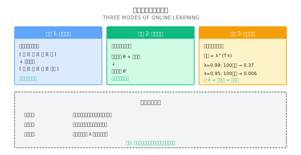
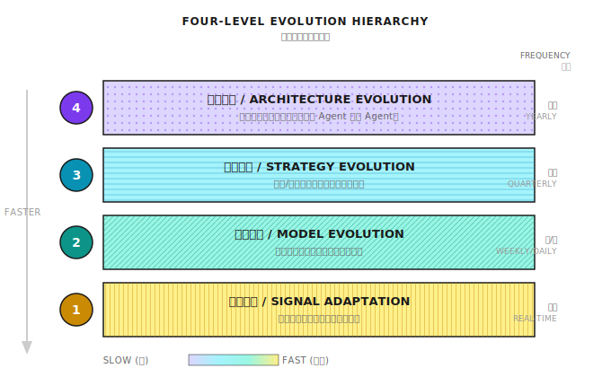
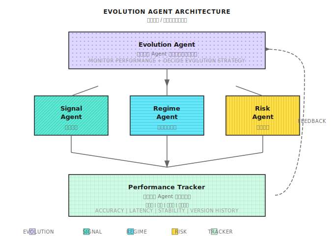
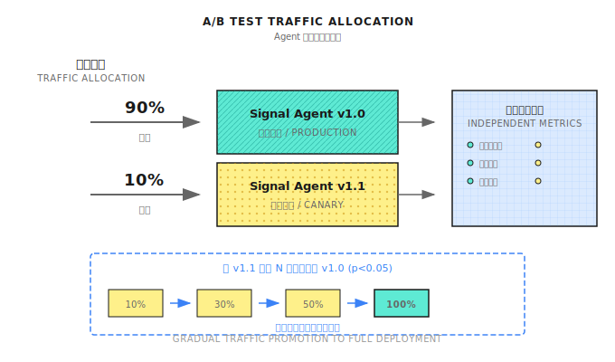

# 第17课：在线学习与策略进化

## 前言

> **目标**：理解为什么静态模型必然衰退，掌握让策略持续进化的核心机制。

---

## 一个典型场景（示意）

> 注：以下为合成示例，用于说明常见现象；数字为示意，不对应任何具体个人/账户。

2018年，某量化交易者开发了基于随机森林的A股选股模型，回测年化35%，夏普1.8。前6个月表现稳定，随后业绩缓慢下滑。12个月后，年化收益从35%降到8%，勉强跑赢指数。

代码无bug，数据无错误，模型完全按设计运行，只是**不再赚钱**。

这就是**概念漂移（Concept Drift）**——"模型学习的数据分布与实际交易的数据分布不再一致。"

---

## 17.1 为什么静态模型必然衰退

### 市场的非平稳性

金融市场本质特征是**非平稳性**：

1. **统计特性会变化**：均值、方差、相关性都不是常数
2. **规律会失效**：有效的alpha会被发现、套利、消失
3. **参与者会适应**：你的策略赚钱 → 别人模仿 → alpha衰减

| 衰退类型 | 表现 | 原因 | 典型周期 |
|---------|------|------|---------|
| **突变型** | 某天突然失效 | 政策变化、黑天鹅事件 | 无法预测 |
| **渐变型** | 收益缓慢下降 | Alpha被套利、市场结构变化 | 6-18个月 |
| **周期型** | 时好时坏 | 市场状态切换（牛熊转换） | 与经济周期相关 |

### 纸上练习：计算Alpha衰减

**场景**：因子IC = 0.05，市场效率提升导致IC每月衰减5%。

```
月份    IC        预期年化（IC×√252×σ，假设σ=20%）
0      0.050      15.8%
6      0.050×0.95^6 = 0.037      11.7%
12     0.050×0.95^12 = 0.027      8.5%
18     0.050×0.95^18 = 0.020      6.3%
24     0.050×0.95^24 = 0.015      4.7%
```

**结论**：即使每月只衰减5%，2年后策略收益只剩原来的30%。

### 为什么"定期重训"不够

| 问题 | 解释 | 后果 |
|------|------|------|
| **信息延迟** | 月度重训最多滞后30天 | 市场变化后一个月才反应 |
| **样本不足** | 新数据只有20个交易日 | 训练数据太少，过拟合风险高 |
| **灾难遗忘** | 完全重训会"忘记"历史规律 | 遇到类似历史情况时无法应对 |

**正确思路**：不是"重新学习"，而是"持续适应"——在保留历史知识的同时，逐步调整以适应新环境。

---

## 17.2 在线学习的核心机制

### 批量学习 vs 在线学习



| 维度 | 批量学习 (Batch) | 在线学习 (Online) |
|------|----------------|----------------|
| **数据处理** | 收集所有数据，一次性训练 | 每来一条数据，更新一次 |
| **更新频率** | 周期性（如月度） | 连续（如每日、每笔交易） |
| **计算资源** | 集中消耗 | 分散消耗 |
| **适应速度** | 慢（最多滞后一个周期） | 快（实时适应） |
| **过拟合风险** | 较低（数据量大） | 较高（需要正则化） |

### 纸上练习：选择遗忘因子

| 环境 | 平均持续时间 | 建议遗忘因子λ | 有效回看天数（权重>10%） |
|------|------------|------------|----------------------|
| 快速切换 | 20天 | 0.90 | ~22天 |
| 中等切换 | 60天 | 0.95 | ~44天 |
| 缓慢切换 | 180天 | 0.99 | ~230天 |

**公式**：有效回看天数 ≈ ln(0.1) / ln(λ)

**自检**：
- λ太大（遗忘太慢）：适应不及时，新环境下亏损
- λ太小（遗忘太快）：过度拟合近期噪声，稳定性差

### 代码实现（工程师参考）

```python
class ExponentialMovingModel:
    """指数遗忘的在线学习模型"""

    def __init__(self, decay_factor: float = 0.95):
        self.lambda_ = decay_factor
        self.weights = None
        self.cumulative_weight = 0

    def update(self, X: np.ndarray, y: float, learning_rate: float = 0.01):
        """增量更新模型"""
        if self.weights is None:
            self.weights = np.zeros(X.shape[0])

        # 预测
        pred = np.dot(self.weights, X)
        error = y - pred

        # 更新权重（带遗忘的梯度下降）
        self.weights = self.lambda_ * self.weights + learning_rate * error * X
        self.cumulative_weight = self.lambda_ * self.cumulative_weight + 1

        return pred, error

    def get_effective_lookback(self, threshold: float = 0.1) -> int:
        """计算有效回看天数"""
        return int(np.log(threshold) / np.log(self.lambda_))
```

---

## 17.3 策略进化的四个层次



### Level 1: 信号适应（最快）

信号适应是最快速的进化层次，不需要重新训练模型。

**示例：动态阈值调整**

```
静态阈值：信号 > 0.5 则买入

动态阈值：
- 计算过去N天信号的分布
- 阈值 = 信号均值 + k × 信号标准差
- 市场波动大时，阈值自动提高，减少交易
- 市场波动小时，阈值自动降低，增加交易
```

**纸上练习**：

| 场景 | 信号均值 | 信号标准差 | k=1.5时阈值 | 解读 |
|------|---------|-----------|------------|------|
| 正常市场 | 0.3 | 0.15 | 0.525 | 适中 |
| 高波动市场 | 0.35 | 0.25 | 0.725 | 更严格，减少交易 |
| 低波动市场 | 0.28 | 0.08 | 0.40 | 更宽松，增加交易 |

### Level 2: 模型进化（中等速度）

模型进化涉及参数更新和特征工程。

**关键机制：特征重要性监控**

```
┌─────────────────────────────────────────────────┐
│           特征重要性变化监控                       │
├──────────────┬───────────┬───────────┬─────────┤
│ 特征         │ 6个月前   │ 现在      │ 趋势    │
├──────────────┼───────────┼───────────┼─────────┤
│ 动量_20D     │ 0.25      │ 0.08      │ ↓ 衰减  │
│ 波动率_30D   │ 0.15      │ 0.22      │ ↑ 增强  │
│ 成交量比     │ 0.18      │ 0.05      │ ↓ 失效  │
│ 财报意外度   │ 0.12      │ 0.18      │ ↑ 有效  │
└──────────────┴───────────┴───────────┴─────────┘

→ 决策：降低动量权重，剔除成交量比，增加波动率权重
```

**进化触发条件**：

| 触发信号 | 阈值 | 动作 |
|---------|------|------|
| 特征重要性下降>50% | 连续3个月 | 降低权重或剔除 |
| 新特征IC显著 | p-value < 0.05 | 候选加入 |
| 模型整体IC下降>30% | 连续2个月 | 触发模型重训 |

### Level 3: 策略进化（较慢）

策略进化涉及策略组合的重新配置。

**策略生命周期管理**：

```
                    孵化期          验证期          成熟期          衰退期
收益/风险比    ▪▪▪▪▪▪▪▪▪▪▪▪▪▪▪  ▪▪▪▪▪▪▪▪▪▪▪  ▪▪▪▪▪▪▪▪▪▪▪▪▪  ▪▪▪▪▪▪▪▪
               纸上交易          小仓位实盘       主力策略         逐步淘汰
               3-6个月           3-6个月         不定            不定

进入条件：      回测通过         夏普>1.0        夏普>1.5         夏普<0.8
               Quality Gate     实盘回撤<15%    连续6月正收益    连续3月亏损

资金分配：      0%              5-10%           20-40%          逐步归零
```

**策略组合的动态权重方法**：

| 权重方法 | 原理 | 优点 | 缺点 |
|---------|------|------|------|
| **等权重** | 每个策略1/N | 简单，分散 | 不区分好坏 |
| **波动率倒数** | 权重∝1/σ | 风险均衡 | 忽略收益差异 |
| **夏普比例** | 权重∝夏普 | 奖励好策略 | 历史不代表未来 |
| **Kelly权重** | 权重=μ/σ² | 理论最优 | 对估计误差敏感 |
| **滑动窗口** | 基于近N天表现 | 适应性强 | 可能追涨杀跌 |

**纸上练习：策略权重分配**

| 策略 | 近3月收益 | 近3月波动率 | 夏普 | 波动率倒数权重 | 夏普比例权重 |
|------|---------|-----------|------|-------------|------------|
| A | 8% | 5% | 1.6 | 0.44 | 0.44 |
| B | 6% | 8% | 0.75 | 0.28 | 0.21 |
| C | 10% | 8% | 1.25 | 0.28 | 0.35 |

### Level 4: 架构进化（最慢）

**典型的架构进化路径**：

```
阶段1: 单策略
└── 一个简单的趋势跟随策略

阶段2: 策略组合
└── 趋势 + 均值回归 + 动量，固定权重

阶段3: 动态组合
└── 根据市场状态动态调整策略权重

阶段4: 多智能体
└── 专家Agent + Meta Agent + Risk Agent

阶段5: 自进化系统
└── 能自动发现、测试、部署新策略的系统
```

**架构进化的触发条件**：

| 信号 | 说明 | 建议动作 |
|------|------|---------|
| 所有策略同时失效 | 不是单个策略问题，是架构问题 | 检查市场状态识别是否失效 |
| 相关性结构变化 | 原本不相关的策略变得高度相关 | 重新设计策略分工 |
| 系统性回撤>30% | 风控机制没能阻止大回撤 | 加强Risk Agent否决权 |
| 新市场状态出现 | 如数字货币、新监管环境 | 增加新的专家Agent |

---

## 17.4 实现在线学习的关键技术

### 1. 概念漂移检测

**常用检测方法**：

| 方法 | 原理 | 适用场景 |
|------|------|---------|
| **DDM** | 监控错误率，显著上升则报警 | 分类问题 |
| **ADWIN** | 自适应窗口，检测分布变化 | 流数据 |
| **Page-Hinkley** | 累积偏差检测 | 均值漂移 |
| **特征分布监控** | 比较特征的KL散度 | 特征漂移 |

**纸上练习：简单的漂移检测**

```
监控指标：模型预测的滑动准确率

时间    准确率    5日均值    是否报警（均值<50%）
D1      55%       55%       否
D2      52%       53.5%     否
D3      48%       51.7%     否
D4      45%       50.0%     否
D5      42%       48.4%     是 ← 触发漂移检测
D6      40%       45.4%     是
```

### 2. 防止灾难性遗忘

| 方法 | 原理 | 适用场景 |
|------|------|---------|
| **Elastic Weight Consolidation (EWC)** | 保护重要参数，减少遗忘 | 深度学习模型 |
| **Memory Replay** | 存储代表性样本，混合训练 | 所有模型 |
| **渐进式网络** | 新任务新模块，不改旧模块 | 多任务学习 |
| **知识蒸馏** | 用旧模型教新模型 | 模型更替 |

**实践建议**：
1. 保留10-20%的历史代表性样本
2. 每次更新时，混合新数据+历史样本
3. 监控在历史测试集上的表现，确保没有遗忘

### 3. 更新时机与频率

| 市场类型 | 更新触发 | 最小间隔 | 最大间隔 |
|---------|---------|---------|---------|
| 高频交易 | 每N笔交易 | 1小时 | 1天 |
| 日内策略 | 收盘后 | 1天 | 1周 |
| 中频策略 | 漂移检测触发 | 1周 | 1月 |
| 低频策略 | 季度复盘 | 1月 | 1季度 |

### 代码实现（工程师参考）

```python
class AdaptiveUpdateScheduler:
    """自适应更新调度器"""

    def __init__(self, min_interval: int = 5, max_interval: int = 20):
        self.min_interval = min_interval  # 最小更新间隔（天）
        self.max_interval = max_interval  # 最大更新间隔（天）
        self.last_update = 0
        self.drift_detector = DDM()  # 漂移检测器

    def should_update(self, day: int, recent_errors: list) -> tuple[bool, str]:
        """决定是否应该更新模型"""
        days_since_update = day - self.last_update

        # 检查漂移
        drift_detected = self.drift_detector.detect(recent_errors)

        # 判断逻辑
        if days_since_update >= self.max_interval:
            return True, "达到最大间隔，强制更新"

        if drift_detected and days_since_update >= self.min_interval:
            return True, "检测到漂移，触发更新"

        return False, "无需更新"

    def record_update(self, day: int):
        self.last_update = day
        self.drift_detector.reset()
```

---

## 17.5 在线学习的工程实现

### 1. 滑动窗口重训实现

```python
from datetime import datetime, timedelta
from typing import Optional, Tuple
import numpy as np
import pandas as pd
from sklearn.ensemble import RandomForestClassifier

class SlidingWindowRetrainer:
    """滑动窗口模型重训器"""

    def __init__(self,
                 window_size_days: int = 252,
                 min_samples: int = 200,
                 retrain_interval_days: int = 20):
        self.window_size = window_size_days
        self.min_samples = min_samples
        self.retrain_interval = retrain_interval_days

        self.model = None
        self.last_train_date = None
        self.training_history = []

    def should_retrain(self, current_date: datetime) -> Tuple[bool, str]:
        """判断是否需要重训"""
        if self.model is None:
            return True, "初始训练"

        days_since_train = (current_date - self.last_train_date).days

        if days_since_train >= self.retrain_interval:
            return True, f"距上次训练已 {days_since_train} 天"

        return False, "无需重训"

    def train(self, data: pd.DataFrame,
              feature_cols: list,
              target_col: str,
              current_date: datetime) -> dict:
        """使用滑动窗口训练模型"""
        window_end = current_date
        window_start = current_date - timedelta(days=self.window_size)

        mask = (data['date'] >= window_start) & (data['date'] < window_end)
        train_data = data[mask]

        if len(train_data) < self.min_samples:
            return {
                'success': False,
                'reason': f'样本不足: {len(train_data)} < {self.min_samples}'
            }

        X = train_data[feature_cols].values
        y = train_data[target_col].values

        self.model = RandomForestClassifier(
            n_estimators=100,
            max_depth=5,
            min_samples_leaf=20,
            random_state=42
        )
        self.model.fit(X, y)

        self.last_train_date = current_date

        train_info = {
            'success': True,
            'date': current_date,
            'window': (window_start, window_end),
            'n_samples': len(train_data),
            'train_accuracy': self.model.score(X, y)
        }
        self.training_history.append(train_info)

        return train_info

    def predict(self, X: np.ndarray) -> np.ndarray:
        if self.model is None:
            raise ValueError("模型尚未训练")
        return self.model.predict_proba(X)[:, 1]
```

### 2. 漂移检测指标实现

#### Population Stability Index (PSI)

```python
def calculate_psi(expected: np.ndarray,
                  actual: np.ndarray,
                  n_bins: int = 10) -> float:
    """
    计算 Population Stability Index

    PSI < 0.1: 无显著漂移
    0.1 <= PSI < 0.25: 中等漂移，需关注
    PSI >= 0.25: 显著漂移，需要处理
    """
    breakpoints = np.percentile(expected, np.linspace(0, 100, n_bins + 1))
    breakpoints[0] = -np.inf
    breakpoints[-1] = np.inf

    expected_counts = np.histogram(expected, bins=breakpoints)[0]
    actual_counts = np.histogram(actual, bins=breakpoints)[0]

    expected_pct = (expected_counts + 1) / (len(expected) + n_bins)
    actual_pct = (actual_counts + 1) / (len(actual) + n_bins)

    psi = np.sum((actual_pct - expected_pct) *
                 np.log(actual_pct / expected_pct))

    return psi


class FeatureDriftMonitor:
    """特征漂移监控器"""

    def __init__(self, psi_threshold: float = 0.2):
        self.baseline_distributions = {}
        self.psi_threshold = psi_threshold
        self.drift_history = []

    def set_baseline(self, feature_name: str, values: np.ndarray):
        self.baseline_distributions[feature_name] = values.copy()

    def check_drift(self, feature_name: str,
                    current_values: np.ndarray,
                    date: datetime) -> dict:
        if feature_name not in self.baseline_distributions:
            raise ValueError(f"未设置基线: {feature_name}")

        baseline = self.baseline_distributions[feature_name]
        psi = calculate_psi(baseline, current_values)

        result = {
            'feature': feature_name,
            'date': date,
            'psi': psi,
            'drift_detected': psi >= self.psi_threshold,
            'severity': 'high' if psi >= 0.25 else
                       ('medium' if psi >= 0.1 else 'low')
        }

        self.drift_history.append(result)
        return result

    def check_all_features(self, current_data: pd.DataFrame,
                           date: datetime) -> dict:
        results = {}
        drifted_features = []

        for feature in self.baseline_distributions:
            if feature in current_data.columns:
                result = self.check_drift(
                    feature,
                    current_data[feature].values,
                    date
                )
                results[feature] = result
                if result['drift_detected']:
                    drifted_features.append(feature)

        return {
            'date': date,
            'features_checked': len(results),
            'features_drifted': len(drifted_features),
            'drifted_features': drifted_features,
            'details': results,
            'action_required': len(drifted_features) > 0
        }
```

#### Kolmogorov-Smirnov 检验

```python
from scipy import stats

def ks_drift_test(baseline: np.ndarray,
                  current: np.ndarray,
                  significance: float = 0.05) -> dict:
    """使用KS检验检测分布漂移"""
    statistic, p_value = stats.ks_2samp(baseline, current)

    return {
        'ks_statistic': statistic,
        'p_value': p_value,
        'drift_detected': p_value < significance,
        'interpretation':
            '分布显著不同' if p_value < significance
            else '分布无显著差异'
    }
```

### 3. 重训 vs 暂停决策框架

```python
class RetrainDecisionEngine:
    """重训决策引擎"""

    def __init__(self,
                 psi_threshold: float = 0.2,
                 performance_drop_threshold: float = 0.3,
                 min_confidence_for_retrain: float = 0.6):
        self.psi_threshold = psi_threshold
        self.perf_threshold = performance_drop_threshold
        self.min_confidence = min_confidence_for_retrain

    def decide(self,
               drift_report: dict,
               performance_report: dict,
               data_quality_report: dict) -> dict:
        """
        决定下一步行动

        返回: 'retrain', 'pause', 'continue', 'investigate'

        决策矩阵：
                           性能下降?
                           是        否
          漂移?   是    [重训]    [观察]
                  否    [暂停]    [继续]
        """
        drift_detected = drift_report.get('action_required', False)
        perf_drop = performance_report.get('ic_change', 0)
        data_quality_ok = data_quality_report.get('quality_score', 1) > 0.8
        sample_size_ok = data_quality_report.get('n_samples', 0) > 200

        if drift_detected:
            if perf_drop > self.perf_threshold:
                if data_quality_ok and sample_size_ok:
                    return {
                        'action': 'retrain',
                        'confidence': 0.9,
                        'reason': '检测到漂移且性能下降，数据质量充足',
                        'urgency': 'high'
                    }
                else:
                    return {
                        'action': 'investigate',
                        'confidence': 0.5,
                        'reason': '需要重训但数据质量不足，需人工介入',
                        'urgency': 'high'
                    }
            else:
                return {
                    'action': 'continue',
                    'confidence': 0.6,
                    'reason': '检测到漂移但性能暂未受影响，继续监控',
                    'urgency': 'low',
                    'next_check_days': 3
                }
        else:
            if perf_drop > self.perf_threshold:
                return {
                    'action': 'pause',
                    'confidence': 0.7,
                    'reason': '性能下降但无明显漂移，建议暂停交易并调查',
                    'urgency': 'medium'
                }
            else:
                return {
                    'action': 'continue',
                    'confidence': 0.95,
                    'reason': '一切正常',
                    'urgency': 'none'
                }


class OnlineLearningPipeline:
    """完整的在线学习流水线"""

    def __init__(self, model_name: str):
        self.model_name = model_name
        self.retrainer = SlidingWindowRetrainer()
        self.drift_monitor = FeatureDriftMonitor()
        self.decision_engine = RetrainDecisionEngine()
        self.state = 'running'  # running, paused, retraining

    def daily_update(self,
                     current_date: datetime,
                     new_data: pd.DataFrame,
                     feature_cols: list,
                     target_col: str) -> dict:
        """每日更新流程"""

        # Step 1: 检查漂移
        drift_report = self.drift_monitor.check_all_features(
            new_data, current_date
        )

        # Step 2: 计算近期表现
        perf_report = self._calculate_performance(new_data, target_col)

        # Step 3: 检查数据质量
        quality_report = self._check_data_quality(new_data, feature_cols)

        # Step 4: 决策
        decision = self.decision_engine.decide(
            drift_report, perf_report, quality_report
        )

        # Step 5: 执行
        if decision['action'] == 'retrain':
            train_result = self.retrainer.train(
                new_data, feature_cols, target_col, current_date
            )
            decision['train_result'] = train_result

        elif decision['action'] == 'pause':
            self.state = 'paused'

        return {
            'date': current_date,
            'drift_report': drift_report,
            'performance_report': perf_report,
            'decision': decision,
            'model_state': self.state
        }

    def _calculate_performance(self, data: pd.DataFrame,
                               target_col: str) -> dict:
        return {
            'ic': 0.03,
            'ic_change': -0.02,
            'hit_rate': 0.52
        }

    def _check_data_quality(self, data: pd.DataFrame,
                            feature_cols: list) -> dict:
        missing_rate = data[feature_cols].isnull().mean().mean()

        return {
            'quality_score': 1 - missing_rate,
            'n_samples': len(data),
            'missing_rate': missing_rate
        }
```

### 4. 纸上练习：何时重训 vs 暂停

| 场景 | PSI | IC变化 | 数据质量 | 决策 | 原因 |
|------|-----|-------|---------|------|------|
| A | 0.05 | -5% | 好 | 继续 | 无显著漂移，性能正常 |
| B | 0.30 | -40% | 好 | 重训 | 漂移+性能严重下降 |
| C | 0.25 | -10% | 好 | 观察 | 漂移但性能尚可 |
| D | 0.08 | -35% | 好 | 暂停 | 无漂移但性能异常，需调查 |
| E | 0.35 | -50% | 差 | 调查 | 需重训但数据质量不支持 |

**关键原则**：
1. **漂移+性能下降 = 重训**（市场变了，模型需要适应）
2. **无漂移+性能下降 = 暂停**（可能是其他问题，别盲目重训）
3. **漂移+性能正常 = 观察**（可能是暂时性波动）
4. **数据质量差 = 先修数据**（否则重训也无效）

---

## 17.6 多智能体视角下的进化



在多智能体架构中，进化不仅是单个模型的更新，还涉及Agent之间的协调。

### Evolution Agent的职责

| 职责 | 具体内容 | 触发条件 |
|------|---------|---------|
| **表现监控** | 追踪每个Agent的准确率、延迟、稳定性 | 持续 |
| **漂移检测** | 检测每个Agent的输出分布变化 | 异常检测触发 |
| **更新调度** | 决定哪个Agent需要更新，更新顺序 | 定期+事件驱动 |
| **版本管理** | 维护每个Agent的版本历史，支持回滚 | 更新后 |
| **A/B测试** | 新版本小流量验证后再全量部署 | 重大更新时 |

### 协调更新的挑战



| 挑战 | 说明 | 解决方案 |
|------|------|---------|
| **更新顺序** | Regime Agent更新可能影响Signal Agent的输入 | 上游Agent先更新，下游观察后再更新 |
| **回滚决策** | 新版本表现不佳时，如何决定回滚 | 预设回滚阈值，如回撤>10% |
| **版本兼容** | 不同版本的Agent之间接口是否兼容 | 版本化API，向后兼容 |
| **全局一致性** | 避免部分更新导致系统状态不一致 | 灰度发布，逐步切换 |

---

## 验收标准

| 验收项 | 达标标准 | 自测方法 |
|-------|---------|---------|
| 理解概念漂移 | 能解释为什么静态模型会衰退 | 用自己的话向非技术人员解释 |
| 计算Alpha衰减 | 能计算给定衰减率下的收益预期 | 完成纸上练习 |
| 选择遗忘因子 | 能根据市场环境选择合适的λ | 解释为什么高频策略需要更小的λ |
| 设计更新策略 | 能为自己的策略设计更新时机 | 画出更新触发条件流程图 |
| 理解进化层次 | 能区分四个层次的进化 | 举例说明每个层次的实际应用 |

### 综合练习

**场景**：A股选股策略表现：

| 时期 | 月均收益 | 月波动率 | IC |
|------|---------|---------|-----|
| 2022 H1 | 2.5% | 4% | 0.05 |
| 2022 H2 | 1.8% | 5% | 0.04 |
| 2023 H1 | 0.8% | 6% | 0.025 |
| 2023 H2 | -0.2% | 7% | 0.01 |

**问题**：
1. 这是什么类型的衰退？
2. 计算IC的月衰减率
3. 应该在什么时候触发模型更新？
4. 推荐什么样的更新策略？

**参考答案**：

1. **渐变型衰退**：收益和IC都在逐步下降，没有突然的断崖

2. **月衰减率计算**：
   - 2022 H1到2023 H2 = 24个月
   - IC从0.05降到0.01
   - 0.05 × (1-r)^24 = 0.01
   - (1-r)^24 = 0.2
   - 1-r = 0.934
   - r ≈ 6.6%/月

3. **触发时机**：
   - IC < 0.03（有效性阈值）时应该触发，即2023 H1左右
   - 实际上2022 H2就应该开始关注（IC下降20%）

4. **推荐更新策略**：
   - Level 1：动态调整阈值，减少交易频率
   - Level 2：检查特征重要性变化，可能需要新特征
   - Level 3：考虑引入新策略分散风险
   - 遗忘因子λ ≈ 0.95，每月增量更新

---

## 本课交付物

完成本课后，你将获得：

1. **概念漂移的量化理解** - 能计算Alpha衰减，预估策略寿命
2. **在线学习的实施框架** - 三种模式（滑动窗口、增量更新、指数遗忘）的适用场景
3. **四层进化体系** - 从信号适应到架构进化的完整路径
4. **多智能体进化机制** - Evolution Agent的设计思路

---

## 本课要点回顾

- 理解静态模型衰退的必然性：概念漂移是市场的本质特征
- 掌握在线学习的三种模式及其适用场景
- 理解策略进化的四个层次及其触发条件
- 理解多智能体架构下的协调更新挑战

---

## 延伸阅读

- 第11课：为什么需要多智能体 - 理解多智能体协作的基础
- 第14课：LLM在量化中的应用 - LLM作为进化系统的一部分
- 背景知识：夏普比率的统计陷阱 - 模型评估的统计误区
- 第21课：项目实战 - 将本课理论付诸实践

---

## 下一课预告

**第18课：交易成本建模与可交易性**

理论到此为止。下一课进入生产与实战阶段——学习如何建模交易成本，评估策略从纸上收益到真实收益的转换率。毕竟，一个Gross Alpha很高但Net Alpha为负的策略，永远只能停留在回测里。
