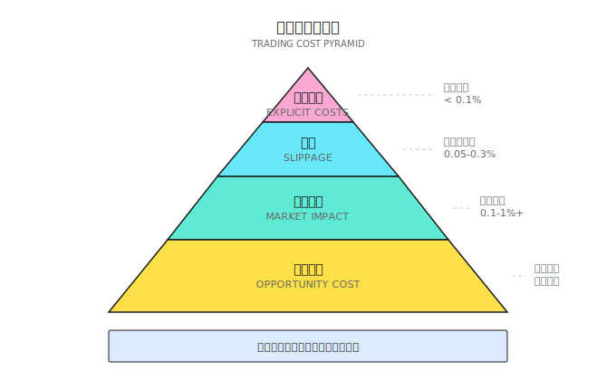
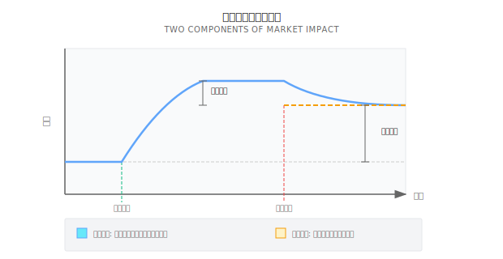
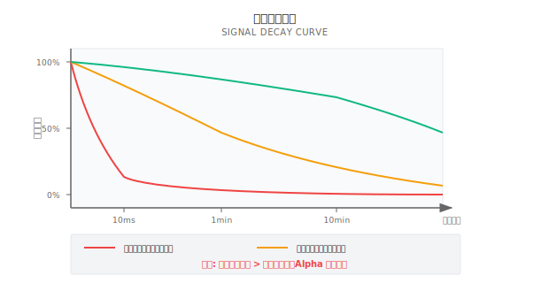
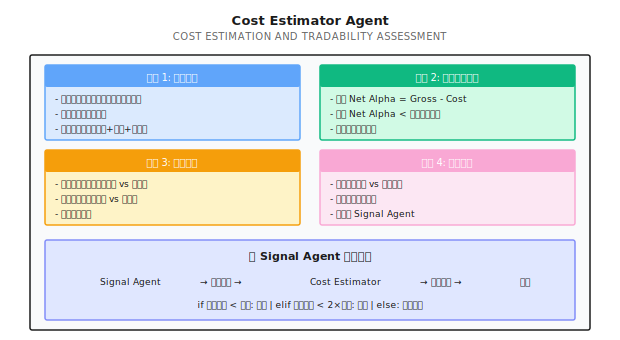

# 第18课：交易成本建模与可交易性

## 核心公式
**Alpha是否存在 = (Gross Alpha − Cost) > 0**

---

## 一个典型场景

一个ML策略回测年化45%、夏普2.3，但日均换手率300%。加入现实成本后：

```
每日成本 = 300% × (0.03% + 0.1% + 0.05%) = 0.54%
年化成本 = 0.54% × 252 = 136%
净收益 = 45% - 136% = -91%
```

"印钞机"变成了"碎钞机"。

---

## 18.1 成本构成



### 显性成本

| 成本类型 | 美股 | A股 | 加密货币 |
|---------|------|-----|---------|
| 佣金 | 0-0.005% | 0.03% | 0.02-0.1% |
| 印花税 | 无 | 0.1%（卖出） | 无 |
| 过户费 | 无 | 0.001% | 无 |

### 隐性成本

#### 滑点 (Slippage)
期望价与实际成交价的差异，来源包括：
- 买卖价差（Bid-Ask Spread）
- 价格移动（下单到成交的时间差）
- 部分成交（订单被拆分）

#### 市场冲击 (Market Impact)
你的交易本身推动价格向不利方向移动。示例：

```
买入10,000股AAPL（市价单）:
  卖一: $100.00 × 2,000股
  卖二: $100.02 × 3,000股
  卖三: $100.05 × 5,000股
加权平均价: $100.029 → 冲击: 0.029%
```

#### 机会成本
因无法成交或延迟成交损失的潜在收益。

---

## 18.2 滑点建模

### 线性模型
```
Slippage = k × OrderSize / ADV
```
- k = 经验系数（0.1-0.5）
- ADV = 日均成交量

**示例**（订单$500,000，k=0.3）：

| 股票 | ADV | 预期滑点 |
|------|-----|---------|
| AAPL | $10B | 0.0015% |
| TSLA | $3B | 0.005% |
| 小盘股X | $10M | **1.5%** |

### 根号模型（Square-Root Model）
```
Slippage = k × σ × √(OrderSize / ADV)
```
滑点与订单大小呈**次线性**关系。

### 代码框架（基于Level-2数据）

```python
def estimate_slippage(order_size: float,
                     order_book: dict,
                     side: str = 'buy') -> float:
    if side == 'buy':
        levels = order_book['asks']
    else:
        levels = order_book['bids']

    mid_price = (order_book['bids'][0][0] + order_book['asks'][0][0]) / 2
    filled = 0
    cost = 0

    for price, size in levels:
        if filled >= order_size:
            break
        fill_amount = min(size, order_size - filled)
        cost += fill_amount * price
        filled += fill_amount

    if filled < order_size:
        return float('inf')

    avg_price = cost / order_size
    slippage = (avg_price - mid_price) / mid_price
    return slippage if side == 'buy' else -slippage
```

---

## 18.3 市场冲击建模

### 临时冲击 vs 永久冲击



- **临时冲击**：交易完成后价格回归
- **永久冲击**：信息被市场吸收，价格不回归

### Almgren-Chriss 模型
```
总成本 = 临时冲击 + 永久冲击 + 波动风险

临时冲击 ∝ 交易速度
永久冲击 ∝ 总交易量
波动风险 ∝ 执行时间 × 波动率
```

**执行策略权衡**（买入$10M AAPL）：

| 执行策略 | 临时冲击 | 波动风险 |
|---------|---------|---------|
| 一次市价单 | 高 | 无 |
| 分10笔（1天） | 低 | 1.5% |
| 分50笔（5天） | 极低 | 3.4% |

---

## 18.4 可交易性评估

### Alpha净化：Gross → Net

```
策略可行 ⟺ Net Alpha > 0
策略可行 ⟺ Gross Alpha > Total Cost
```

| 策略 | 毛Alpha | 换手率 | 年化成本 | 净Alpha |
|------|---------|--------|---------|--------|
| A | 15% | 50% | 2% | 13% ✓ |
| D | 40% | 1000% | 40% | 0% ✗ |
| E | 50% | 2000% | 80% | -30% ✗ |

**关键发现**：毛Alpha最高的策略E净收益最低；**高换手率是收益的杀手**。

---

## 18.5 策略同质化

2024年2月A股市场：大量量化私募超配小微盘股，使用相似因子（小市值+动量），集体止损引发正反馈螺旋。

**头部机构年内收益（至2024年6月）**：

| 机构 | 产品 | 年内收益 |
|------|------|---------|
| 九坤投资 | 500指增 | -13.67% |
| 灵均投资 | 500指增 | -12.64% |
| 幻方量化 | 500指增 | -8.96% |

策略同质化是**成本放大器**——当所有人同时卖出，市场冲击和滑点成倍增加。

---

## 18.6 为什么ML Alpha不可交易

### 信号衰减 vs 执行延迟



| Alpha类型 | 典型衰减 | 容量 |
|----------|---------|------|
| 做市价差 | 毫秒 | $1-10M |
| 统计套利 | 秒-分钟 | $10-100M |
| 技术动量 | 分钟-小时 | $100M-1B |
| 基本面因子 | 天-周 | $1B+ |

### 案例：高胜率策略崩溃

```
信号发出时: 预期收益 +0.5%
2分钟后（衰减50%）: +0.25%
5分钟后（实际执行）: +0.06%
减去成本0.1%: 净收益 -0.04%
65%胜率 × (-0.04%) = 持续亏损
```

---

## 18.7 多智能体视角



### 成本意识的策略设计原则

| 设计原则 | 实现方式 |
|---------|---------|
| 降低换手率 | 延长持仓周期、提高信号阈值 |
| 选择高流动性标的 | 过滤ADV低于阈值的股票 |
| 避开高波动时段 | 不在开盘/收盘/事件期交易 |
| 使用智能订单 | TWAP、VWAP、算法交易 |

---

## 本课要点

- 交易成本 = 显性成本 + 滑点 + 市场冲击 + 机会成本
- 滑点与订单大小/ADV呈**根号关系**
- 策略可行性 = Net Alpha > 0
- 高换手率是Alpha的杀手
- ML容易发现短期信号，但执行延迟可能使其无法捕获
