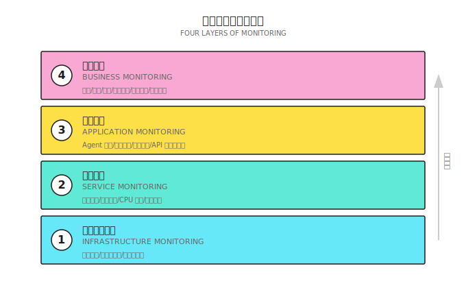
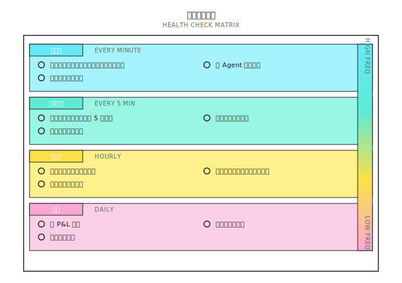
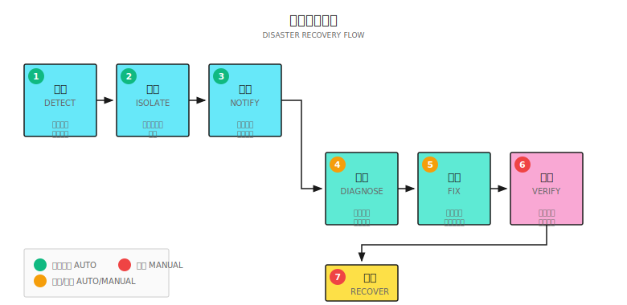
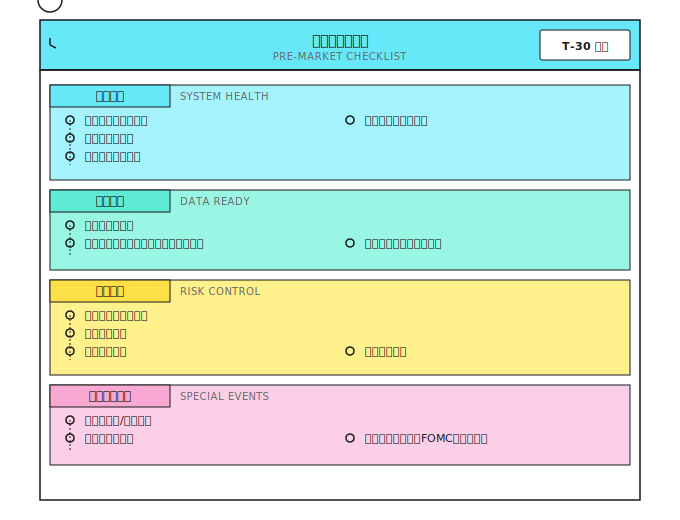
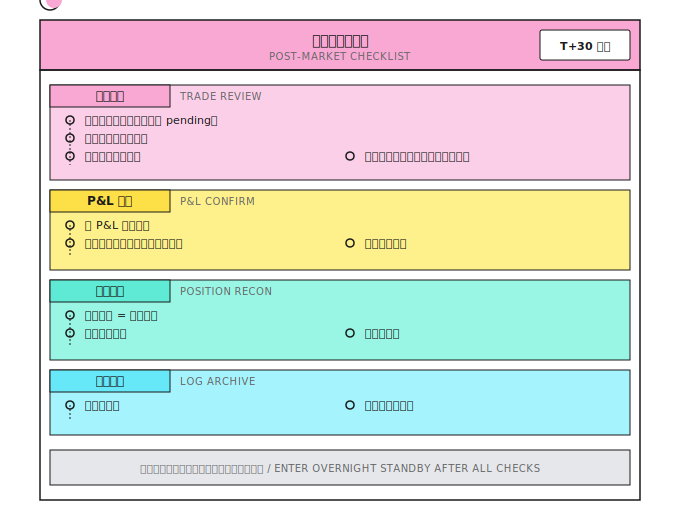
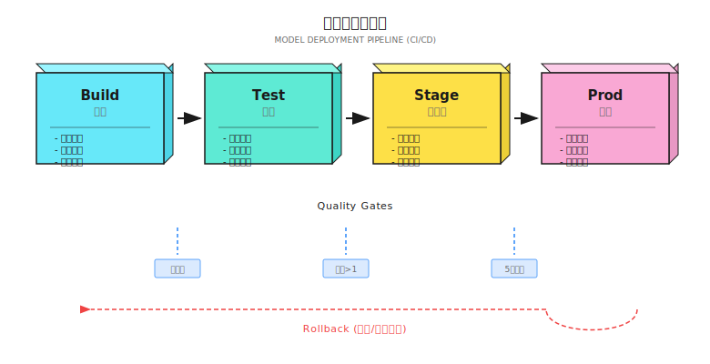
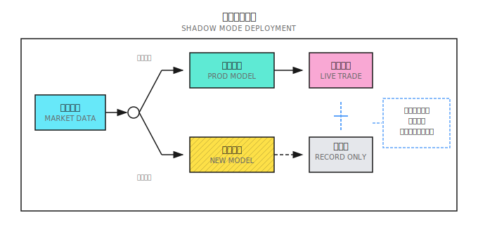
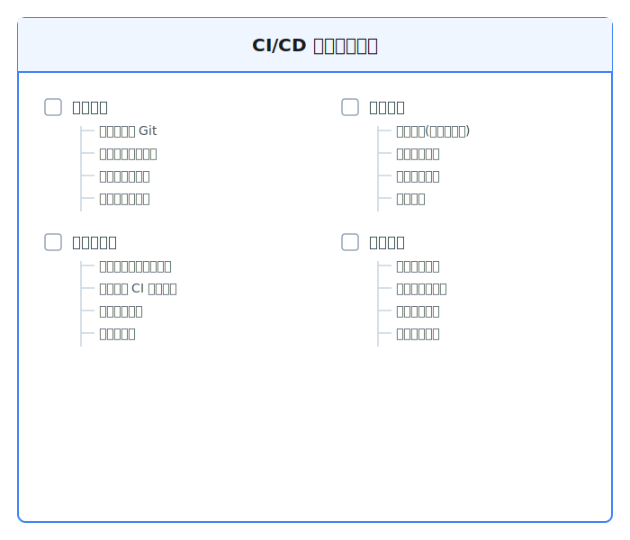
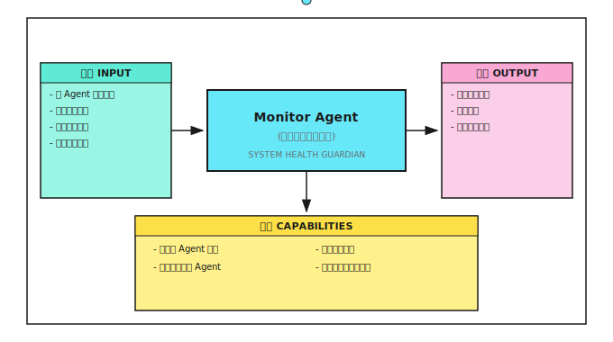

# 第20课：生产运维

## 一个典型场景（示意）

某独立量化交易者上线自动交易系统后第三周，因数据源API改版、异常被静默吞掉、无监控告警、无熔断机制，导致账户亏损40%。

**四大根本问题：**
- 没有健康检查
- 异常被吞掉
- 没有监控告警
- 没有熔断机制

---

## 20.1 监控体系

### 监控的四个层次



| 层次 | 指标 | 阈值示例 | 告警级别 |
|------|------|----------|----------|
| **基础设施** | 服务器存活 | 心跳超时30s | 严重 |
| **服务** | CPU使用率 | >80%持续5分钟 | 警告 |
| **应用** | 数据源连接 | 断开>1分钟 | 严重 |
| **业务** | 日回撤 | >3% | 警告 |

---

## 20.2 日志系统

### 日志黄金法则

| 原则 | 解释 | 反例 |
|------|------|------|
| **结构化** | JSON格式 | 自由文本"买入成功" |
| **可追溯** | 包含trace_id | 无法关联同一交易的多条日志 |
| **分级别** | DEBUG/INFO/WARN/ERROR | 全用print() |
| **带上下文** | 含时间、标的、价格、数量 | 只有"Error occurred" |

### 交易日志标准格式

```json
{
  "timestamp": "2024-01-15T09:30:00.123Z",
  "level": "INFO",
  "service": "execution_agent",
  "trace_id": "tx_20240115_001",
  "event": "order_submitted",
  "data": {
    "symbol": "AAPL",
    "side": "BUY",
    "quantity": 100,
    "price": 180.50,
    "order_type": "LIMIT",
    "order_id": "ORD_12345"
  },
  "context": {
    "signal_id": "sig_20240115_001",
    "signal_strength": 0.75,
    "regime": "trending",
    "portfolio_value": 1000000
  }
}
```

---

## 20.3 告警系统

### 告警通道

| 级别 | 通道 | 响应时间要求 |
|------|------|--------------|
| **低** | 邮件、日报汇总 | 次日处理 |
| **中** | Slack/钉钉消息 | 1小时内 |
| **高** | 短信+电话 | 5分钟内 |
| **紧急** | 自动熔断+电话 | 立即 |

### 告警模板示例

```
🚨 [严重] 交易系统告警

时间: 2024-01-15 10:30:15 EST
服务: Risk Agent
事件: 回撤触发控制线

详情:
- 当前回撤: 10.2%
- 触发阈值: 10%
- 今日 P&L: -$52,000
- 账户净值: $948,000

已执行动作:
- 停止新开仓
- 开始减仓流程
```

### 告警抑制策略

| 问题 | 解决方案 |
|------|----------|
| 同一问题重复告警 | 聚合：同类告警5分钟内只发一条 |
| 瞬时抖动触发告警 | 持续：阈值需持续N分钟才告警 |
| 夜间非交易时段 | 静默期：降级为低优先级 |

---

## 20.4 容灾与恢复

### 故障分类



| 故障类型 | 示例 | 恢复策略 |
|----------|------|----------|
| **数据源故障** | API不可用 | 切换备用源 |
| **交易接口故障** | 券商系统维护 | 暂停交易，记录待执行 |
| **本地服务故障** | Agent进程崩溃 | 自动重启 |
| **数据错误** | 行情异常跳动 | 识别异常，暂停处理 |

### 恢复后状态一致性检查



| 检查项 | 方法 | 不一致时处理 |
|--------|------|--------------|
| 持仓一致 | 对比系统记录与券商 | 以券商为准 |
| 订单状态 | 查询所有pending订单 | 取消或确认 |
| 资金余额 | 对比计算值与实际值 | 重新计算 |

---

## 20.5 交易时段自动化

```
美股交易日调度（东部时间 ET）：

09:15  系统自动启动
       ├── 数据源连接检查
       ├── 券商 API 心跳验证
       ├── 持仓状态同步
       └── 开盘前检查清单自动执行

09:30  交易窗口开启
       └── Agent 开始接收信号并执行

16:00  交易窗口关闭
       └── 停止新开仓

16:05  收盘后处理
       ├── 收盘后检查自动执行
       ├── 日度 P&L 结算
       ├── 日志归档
       └── 日报推送

16:30  系统自动停止
```

**关键要求：** 仅工作日运行、时区统一用UTC、优雅启停、维护假日日历。

---

## 20.6 日常运维清单





### 周度/月度检查

| 频率 | 检查项 | 目的 |
|------|--------|------|
| **周度** | 策略表现回顾 | 识别异常趋势 |
| **周度** | 告警汇总分析 | 发现系统性问题 |
| **月度** | 完整P&L归因 | 策略评估 |
| **月度** | 模型漂移检测 | 识别失效信号 |
| **月度** | 灾难恢复演练 | 验证恢复流程 |

---

## 20.7 Provider 抽象模式

```
数据源接口:
  Connect()     → 建立连接
  Subscribe()   → 订阅标的
  Stream()      → 接收实时行情

执行通道接口:
  SubmitOrder()  → 提交订单
  CancelOrder()  → 撤销订单
  QueryStatus()  → 查询状态
```

每个具体供应商实现这些接口，策略逻辑、风控规则与监控系统无需修改。

---

## 20.8 模型部署与 CI/CD

### 20.8.1 传统做法问题

| 问题 | 后果 |
|------|------|
| 手动部署 | 容易遗漏步骤、配置错误 |
| 没有版本追溯 | 出问题时无法回滚 |
| 环境不一致 | 生产环境挂了 |
| 模型更新无记录 | 不知道何时为何更新 |

### 20.8.2 CI/CD 流水线各阶段



**阶段一：Build（构建）**

```yaml
# 示例：GitHub Actions 配置
build:
  steps:
    - name: 检出代码
      uses: actions/checkout@v3

    - name: 安装依赖
      run: pip install -r requirements.txt

    - name: 类型检查
      run: mypy src/ --strict

    - name: 代码规范
      run: ruff check src/

    - name: 打包模型
      run: |
        python -m src.models.package \
          --model-path models/signal_v3.pkl \
          --output artifacts/
```

**阶段二：Test（测试）**

| 测试类型 | 内容 | 通过标准 |
|----------|------|----------|
| **单元测试** | 函数逻辑正确 | 100%通过 |
| **集成测试** | Agent间协作正常 | 100%通过 |
| **回测验证** | 历史数据上的表现 | 夏普>阈值，回撤<阈值 |
| **健全性检查** | 无明显过拟合 | 样本外夏普>样本内×0.7 |

**双层回测验证：**

| 层次 | 方法 | 验证目标 | 速度 |
|------|------|----------|------|
| **第一层** | 向量化回测 | 信号逻辑正确性 | 秒级 |
| **第二层** | OMS集成回测 | 执行真实性（滑点、部分成交） | 分钟级 |

```python
# 回测验证示例
def test_model_performance():
    """确保新模型在回测中达到最低标准"""
    results = run_backtest(
        model='models/signal_v3.pkl',
        start_date='2022-01-01',
        end_date='2023-12-31'
    )

    assert results['sharpe'] >= 1.0, f"夏普比率不足: {results['sharpe']}"
    assert results['max_drawdown'] <= 0.15, f"回撤过大: {results['max_drawdown']}"
    assert results['win_rate'] >= 0.45, f"胜率不足: {results['win_rate']}"

    # 过拟合检查
    in_sample_sr = results['in_sample_sharpe']
    out_sample_sr = results['out_sample_sharpe']
    assert out_sample_sr >= in_sample_sr * 0.7, "样本外表现衰减过大，可能过拟合"
```

**阶段三：Stage（影子模式）**



| 指标 | 通过标准 | 检查周期 |
|------|----------|----------|
| 信号一致性 | 新旧信号相关性>0.9或改进明显 | 实时 |
| 延迟 | 新模型延迟<生产模型×1.2 | 每小时 |
| 异常信号 | 无极端信号(>3标准差) | 实时 |
| 运行时长 | 至少5个交易日 | - |

**阶段四：灰度发布策略**

| 策略 | 风险控制 |
|------|----------|
| **Canary（金丝雀）** | 5% -> 25% -> 50% -> 100% |
| **Blue-Green** | 随时可切回旧版本 |
| **Rolling** | 一次替换一个实例 |

```python
class CanaryDeployment:
    """金丝雀部署控制器"""

    def __init__(self, old_model, new_model):
        self.old_model = old_model
        self.new_model = new_model
        self.canary_weight = 0.05  # 从 5% 开始

    def get_signal(self, market_data: dict) -> dict:
        # 按权重分配流量
        if random.random() < self.canary_weight:
            signal = self.new_model.predict(market_data)
            signal['model_version'] = 'canary'
        else:
            signal = self.old_model.predict(market_data)
            signal['model_version'] = 'stable'
        return signal

    def promote_canary(self, new_weight: float):
        """提升金丝雀权重，逐步放量"""
        if new_weight > self.canary_weight:
            log.info(f"提升金丝雀权重: {self.canary_weight:.0%} → {new_weight:.0%}")
            self.canary_weight = new_weight

    def rollback(self):
        """回滚到稳定版本"""
        log.warning("金丝雀回滚！切回稳定版本")
        self.canary_weight = 0.0
```

### 20.8.4 模型版本管理

```
模型版本格式: v{major}.{minor}.{patch}-{timestamp}

示例:
  v2.3.1-20240115  # 2024年1月15日的 v2.3.1 版本

版本规则:
  major: 模型架构变化（如从 XGBoost 换成神经网络）
  minor: 特征或参数调整
  patch: bug 修复
```

**模型注册表字段：** model_id、created_at、created_by、metrics、status（staging/production/retired）、artifact_path、config_hash、data_hash。

### 20.8.5 自动回滚

```python
class AutoRollback:
    """自动回滚控制器"""

    def __init__(self, rollback_thresholds: dict):
        self.thresholds = rollback_thresholds
        self.metrics_buffer = []

    def check_and_rollback(self, current_metrics: dict) -> bool:
        """检查是否需要回滚"""

        # 即时回滚条件（单次触发）
        if current_metrics.get('error_rate', 0) > self.thresholds['max_error_rate']:
            self.trigger_rollback("错误率过高")
            return True

        if current_metrics.get('latency_p99', 0) > self.thresholds['max_latency']:
            self.trigger_rollback("延迟过高")
            return True

        # 累积回滚条件（趋势判断）
        self.metrics_buffer.append(current_metrics)
        if len(self.metrics_buffer) >= 10:  # 足够样本
            recent_sharpe = np.mean([m['sharpe'] for m in self.metrics_buffer[-10:]])
            if recent_sharpe < self.thresholds['min_sharpe']:
                self.trigger_rollback(f"夏普下降: {recent_sharpe:.2f}")
                return True

        return False

    def trigger_rollback(self, reason: str):
        """执行回滚"""
        log.error(f"触发自动回滚: {reason}")

        # 1. 切换到上一个稳定版本
        model_registry.activate('last_stable')

        # 2. 发送告警
        alert_system.send(
            level='critical',
            title='模型自动回滚',
            message=f'原因: {reason}'
        )

        # 3. 记录回滚事件
        audit_log.record('rollback', {'reason': reason})
```

---



## 20.9 多智能体视角



### Agent间健康协作

| Agent | 向Monitor报告 | 接收Monitor指令 |
|-------|---------------|-----------------|
| Signal Agent | 信号生成延迟、成功率 | 暂停/恢复 |
| Risk Agent | 风控触发次数、状态 | 强制熔断 |
| Execution Agent | 订单状态、成交质量 | 取消待执行订单 |
| Regime Agent | 检测延迟、置信度 | 切换到默认状态 |
| Data Agent | 数据更新时间、质量 | 切换数据源 |

---

## 验收标准

| 验收项 | 达标标准 |
|--------|----------|
| 理解监控层次 | 能描述四层监控的内容 |
| 设计日志格式 | 能设计结构化交易日志 |
| 设计告警规则 | 能区分告警级别和通道 |
| 理解恢复流程 | 能描述故障恢复步骤 |

---

## 本课要点回顾

- 理解监控的四个层次及其关键指标
- 掌握结构化日志的设计原则
- 理解告警系统的设计要点
- 掌握故障恢复流程和状态一致性检查
- 建立日常运维检查的习惯
- 设计CI/CD流水线实现模型安全部署
