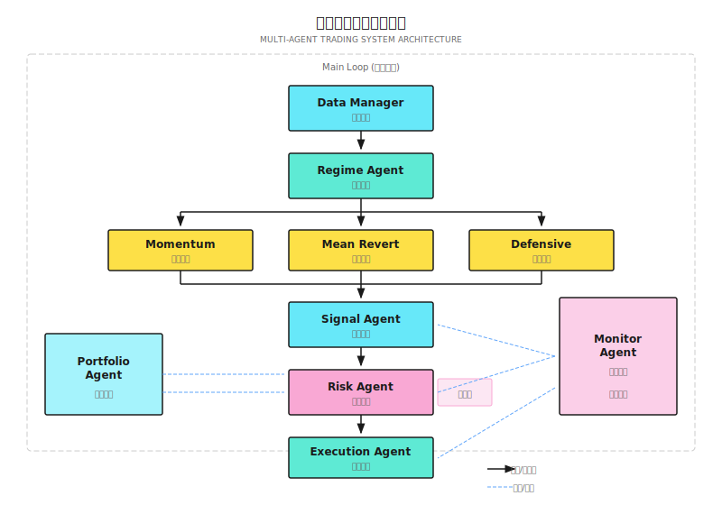

# 第21课：项目实战

## 项目概述

本课整合前20课知识，构建端到端多智能体交易系统框架，可扩展为真实交易系统。

### 系统目标

| 维度 | 目标 | 非目标 |
|------|------|--------|
| 功能 | 识别市场状态、生成信号、控制风险、执行交易 | 高频交易、复杂衍生品 |
| 市场 | 美股日频策略 | 分钟级以下策略 |
| 规模 | 10-50只股票组合 | 千只股票选股 |
| 运行 | 本地开发+模拟盘 | 直接实盘 |

### 最终交付物结构

```
multi-agent-trading-system/
├── agents/
│   ├── regime_agent.py
│   ├── signal_agent.py
│   ├── risk_agent.py
│   ├── execution_agent.py
│   └── monitor_agent.py
├── core/
│   ├── data_manager.py
│   ├── portfolio.py
│   └── order.py
├── strategies/
│   ├── momentum.py
│   └── mean_revert.py
├── config/
│   └── settings.yaml
├── tests/
└── main.py
```

---

## 21.1 系统架构



### 数据流

```
行情数据 ─────► Data Manager ─────► 各 Agent
                    │
                    ▼
持仓/余额 ◄───── Portfolio ◄──────── Execution Agent
                    │
                    ▼
日志/指标 ─────► Monitor Agent ─────► 告警
```

> **教学代码到生产系统**：风控引擎用Rust，订单管理用Go，研究/ML用Python。关键是"清晰的模块边界和标准化的通信协议"。

### 架构演进：模块化单体优先

```
阶段1：模块化单体
├── 所有Agent在同一进程内运行
├── 通过函数调用通信（零延迟）
└── 适合: 单市场、<$1M 资金

阶段2：选择性拆分
├── 延迟敏感组件独立（如风控引擎）
├── 用gRPC替代函数调用
└── 适合: 多市场、不同延迟要求

阶段3：完全分布式
├── 每个Agent独立部署
├── 消息队列解耦
└── 适合: 团队协作、独立扩缩容
```

---

## 21.2 分步实现

### Step 1: 数据管理器

| 方法 | 输入 | 输出 | 用途 |
|------|------|------|------|
| `get_history` | symbol, days | DataFrame | 获取历史数据 |
| `get_latest` | symbols | Dict | 获取最新价格 |
| `calculate_indicators` | df | df with indicators | 计算技术指标 |
| `validate` | df | bool, errors | 数据质量检查 |

```python
import yfinance as yf
import pandas as pd
import numpy as np
from typing import List, Dict, Optional

class DataManager:
    def __init__(self, cache_dir: str = "./data_cache"):
        self.cache_dir = cache_dir

    def get_history(self, symbol: str, days: int = 252, end_date: Optional[str] = None) -> pd.DataFrame:
        ticker = yf.Ticker(symbol)
        df = ticker.history(period=f"{days}d")
        df = df.rename(columns={"Open": "open", "High": "high", "Low": "low", "Close": "close", "Volume": "volume"})
        return df[["open", "high", "low", "close", "volume"]]

    def calculate_indicators(self, df: pd.DataFrame) -> pd.DataFrame:
        df["sma_20"] = df["close"].rolling(20).mean()
        df["sma_50"] = df["close"].rolling(50).mean()
        df["volatility"] = df["close"].pct_change().rolling(20).std() * np.sqrt(252)
        delta = df["close"].diff()
        gain = delta.where(delta > 0, 0).rolling(14).mean()
        loss = (-delta.where(delta < 0, 0)).rolling(14).mean()
        df["rsi"] = 100 - (100 / (1 + gain / loss))
        high_low = df["high"] - df["low"]
        high_close = (df["high"] - df["close"].shift()).abs()
        low_close = (df["low"] - df["close"].shift()).abs()
        tr = pd.concat([high_low, high_close, low_close], axis=1).max(axis=1)
        df["atr"] = tr.rolling(14).mean()
        return df

    def validate(self, df: pd.DataFrame) -> tuple:
        errors = []
        if df.empty:
            errors.append("DataFrame is empty")
        if df["close"].isnull().any():
            errors.append(f"Missing close prices: {df['close'].isnull().sum()}")
        if (df["close"] <= 0).any():
            errors.append("Invalid prices (<=0)")
        return len(errors) == 0, errors
```

---

### Step 2: Regime Agent

输出格式：
- `regime`: "trending" | "mean_reverting" | "crisis" | "uncertain"
- `confidence`: 0.0 - 1.0
- `regime_weights`: 各策略权重字典

| 条件 | 状态 | 权重分配 |
|------|------|----------|
| ADX>25 且 Vol<25% | 趋势 | 趋势80%, 均值回归15%, 防守5% |
| ADX<20 且 Vol<20% | 震荡 | 趋势20%, 均值回归70%, 防守10% |
| Vol>30% 且 Corr>0.7 | 危机 | 趋势10%, 均值回归10%, 防守80% |
| 其他 | 不确定 | 各33% |

```python
from dataclasses import dataclass
from typing import Dict

@dataclass
class RegimeState:
    regime: str
    confidence: float
    weights: Dict[str, float]

class RegimeAgent:
    def __init__(self, config: dict = None):
        self.config = config or {}
        self.adx_threshold = self.config.get("adx_threshold", 25)
        self.vol_crisis = self.config.get("vol_crisis", 0.30)

    def detect(self, market_data: dict) -> RegimeState:
        adx = market_data.get("adx", 20)
        vol = market_data.get("volatility", 0.15)
        corr = market_data.get("correlation", 0.5)

        if vol > self.vol_crisis and corr > 0.7:
            return RegimeState("crisis", 0.8, {"momentum": 0.1, "mean_revert": 0.1, "defensive": 0.8})
        if adx > self.adx_threshold and vol < 0.25:
            return RegimeState("trending", 0.7, {"momentum": 0.7, "mean_revert": 0.2, "defensive": 0.1})
        if adx < 20 and vol < 0.20:
            return RegimeState("mean_reverting", 0.6, {"momentum": 0.2, "mean_revert": 0.7, "defensive": 0.1})
        return RegimeState("uncertain", 0.3, {"momentum": 0.33, "mean_revert": 0.33, "defensive": 0.34})
```

---

### Step 3: Signal Agent

| 场景 | 处理方式 |
|------|----------|
| 单一策略信号 | 直接输出，强度 = 策略信号 × 状态权重 |
| 多策略一致 | 增强信号强度，取加权平均 |
| 多策略冲突 | 取权重更高策略，或不交易 |

```python
from dataclasses import dataclass
from typing import List

@dataclass
class Signal:
    symbol: str
    direction: str  # "long" | "short" | "close"
    strength: float
    source: str
    timestamp: str

class SignalAgent:
    def __init__(self, strategies: list):
        self.strategies = strategies

    def generate_signals(self, market_data: dict, regime_weights: dict) -> List[Signal]:
        all_signals = {}
        for strategy in self.strategies:
            strategy_name = strategy.name
            weight = regime_weights.get(strategy_name, 0.33)
            raw_signals = strategy.generate(market_data)
            for sig in raw_signals:
                key = (sig.symbol, sig.direction)
                weighted_strength = sig.strength * weight
                if key in all_signals:
                    all_signals[key].strength += weighted_strength
                else:
                    all_signals[key] = Signal(sig.symbol, sig.direction, weighted_strength, strategy_name, sig.timestamp)
        return [s for s in all_signals.values() if s.strength > 0.3]
```

---

### Step 4: Risk Agent

| 规则 | 检查内容 | 触发动作 |
|------|----------|----------|
| 单笔上限 | 仓位>10% | 缩小至10% |
| 标的上限 | 同标的>20% | 拒绝或缩小 |
| 总仓位上限 | 总仓位>80% | 拒绝 |
| 回撤控制 | 当前回撤>10% | 拒绝所有开仓 |
| 熔断 | 回撤>15% | 强制减仓 |

```python
from enum import Enum
from dataclasses import dataclass
from typing import Optional

class Decision(Enum):
    APPROVE = "approve"
    REDUCE = "reduce"
    REJECT = "reject"

@dataclass
class RiskDecision:
    decision: Decision
    reason: str
    adjusted_size: Optional[float] = None

class RiskAgent:
    def __init__(self, config: dict):
        self.max_single = config.get("max_single_position", 0.10)
        self.max_symbol = config.get("max_symbol_exposure", 0.20)
        self.max_total = config.get("max_total_exposure", 0.80)
        self.drawdown_stop = config.get("drawdown_stop", 0.10)
        self.drawdown_circuit = config.get("drawdown_circuit", 0.15)

    def check(self, signal, proposed_size, portfolio, current_drawdown) -> RiskDecision:
        if current_drawdown >= self.drawdown_circuit:
            return RiskDecision(Decision.REJECT, "Circuit breaker active")
        if current_drawdown >= self.drawdown_stop:
            if signal.direction != "close":
                return RiskDecision(Decision.REJECT, "Drawdown limit reached")
        if proposed_size > self.max_single:
            return RiskDecision(Decision.REDUCE, "Size exceeds single limit", adjusted_size=self.max_single)
        current_exposure = portfolio.get(signal.symbol, 0)
        if current_exposure + proposed_size > self.max_symbol:
            allowed = self.max_symbol - current_exposure
            if allowed <= 0:
                return RiskDecision(Decision.REJECT, "Symbol limit reached")
            return RiskDecision(Decision.REDUCE, "Symbol limit", adjusted_size=allowed)
        total_exposure = sum(portfolio.values()) + proposed_size
        if total_exposure > self.max_total:
            return RiskDecision(Decision.REJECT, "Total exposure limit")
        return RiskDecision(Decision.APPROVE, "Passed all checks")
```

---

### Step 5: Execution Agent

```python
from dataclasses import dataclass
from enum import Enum
from datetime import datetime
import uuid

class OrderStatus(Enum):
    PENDING = "pending"
    SUBMITTED = "submitted"
    FILLED = "filled"
    CANCELLED = "cancelled"
    REJECTED = "rejected"

@dataclass
class Order:
    order_id: str
    symbol: str
    side: str
    quantity: int
    order_type: str
    limit_price: float = None
    status: OrderStatus = OrderStatus.PENDING
    filled_price: float = None
    filled_time: str = None

class ExecutionAgent:
    def __init__(self, broker_client=None, is_paper: bool = True):
        self.broker = broker_client
        self.is_paper = is_paper
        self.orders = {}

    def create_order(self, symbol, direction, size, portfolio_value, current_price) -> Order:
        dollar_amount = portfolio_value * size
        quantity = int(dollar_amount / current_price)
        if quantity <= 0:
            return None
        side = "buy" if direction == "long" else "sell"
        order = Order(order_id=str(uuid.uuid4())[:8], symbol=symbol, side=side, quantity=quantity, order_type="market")
        self.orders[order.order_id] = order
        return order

    def submit_order(self, order: Order) -> bool:
        if self.is_paper:
            order.status = OrderStatus.FILLED
            order.filled_time = datetime.now().isoformat()
            return True
        return True
```

---

### Step 6: 主循环

```python
def main_loop():
    market_data = data_manager.get_latest(symbols)
    regime_state = regime_agent.detect(market_data)
    signals = signal_agent.generate(market_data, regime_state.weights)

    for signal in signals:
        proposed_size = calculate_position_size(signal)
        decision = risk_agent.check(signal, proposed_size, portfolio, drawdown)

        if decision.decision == Decision.APPROVE:
            size = proposed_size
        elif decision.decision == Decision.REDUCE:
            size = decision.adjusted_size
        else:
            continue

        order = execution_agent.create_order(signal.symbol, signal.direction, size, portfolio_value, current_price)
        execution_agent.submit_order(order)

    portfolio.update()
    monitor_agent.log_daily_summary()
```

---

## 21.3 回测验证

> "回测不是为了证明策略有效，而是为了发现策略的问题。"

### 回测清单

| 检查项 | 通过标准 |
|--------|----------|
| 无未来数据泄漏 | 所有数据T+1可用 |
| 成本建模真实 | 包含滑点、手续费 |
| 样本外验证 | OOS夏普 > IS夏普×0.7 |
| 参数稳定性 | 参数±20%策略不崩溃 |
| 极端情况测试 | 2008、2020年单独测试 |

### 关键回测指标

| 指标 | 目标值 | 警戒值 |
|------|--------|--------|
| 年化收益 | >15% | <10% |
| 夏普比率 | >1.0 | <0.5 |
| 最大回撤 | <20% | >30% |
| 胜率 | >50% | <40% |
| 盈亏比 | >1.5 | <1.0 |
| 换手率 | <500%/年 | >1000%/年 |

---

## 21.4 从模拟到实盘

### 阶段性验证

```
Stage 1: 历史回测 (2-4周)
├── 验证策略逻辑正确
└── 目标: 回测指标达标

Stage 2: 纸上交易 (2-4周)
├── 用真实行情，假的交易
└── 目标: 执行无误

Stage 3: 小资金实盘 (4-8周)
├── 投入5-10%计划资金
└── 目标: 实盘表现与回测接近

Stage 4: 逐步加仓 (持续)
├── 每月评估，逐步增加资金
└── 目标: 稳定盈利
```

### 实盘前检查清单

```
□ 系统检查
  ├── 所有Agent进程稳定运行>1周
  ├── 告警系统测试通过
  └── 灾难恢复流程验证

□ 策略检查
  ├── 回测通过Quality Gate
  ├── 模拟盘运行>2周
  └── 极端情况有预案

□ 运维检查
  ├── 开盘前/收盘后检查清单就绪
  └── 备用方案准备

□ 心理准备
  ├── 明确风险承受能力
  ├── 设定明确止损线
  └── 准备好面对回撤
```

---

## 21.5 项目扩展方向

| 方向 | 描述 | 复杂度 |
|------|------|--------|
| 多市场 | 支持A股、港股、加密货币 | 中 |
| 多时间框架 | 支持分钟级策略 | 高 |
| LLM集成 | 新闻分析、研报解读 | 中 |
| 在线学习 | 策略自动进化 | 高 |
| Web界面 | 可视化监控 | 中 |
| 分布式部署 | 多服务器运行 | 高 |

---

## 验收标准

### 项目验收清单

| 阶段 | 验收项 | 通过标准 |
|------|--------|----------|
| 代码 | 系统能运行 | `python main.py`无报错 |
| 代码 | 各Agent正常工作 | 日志显示各Agent输出 |
| 回测 | 回测能跑通 | 生成回测报告 |
| 回测 | 无明显bug | 回测曲线合理 |
| 模拟 | 能获取实时数据 | 日志显示最新价格 |
| 模拟 | 风控生效 | 超限订单被拒绝 |
| 文档 | 有README | 他人能看懂如何运行 |

### 自评问题

1. 系统在什么市场状态下表现最好/最差？
2. 回撤最大的一次是什么原因？
3. 如果明天上实盘，最担心什么？
4. 系统还有哪些可以改进的地方？

---

## 本课要点回顾

- 理解多智能体系统的整体架构
- 掌握各Agent的职责和接口设计
- 能够将前20课知识整合到一个系统中
- 理解从回测到实盘的验证路径
